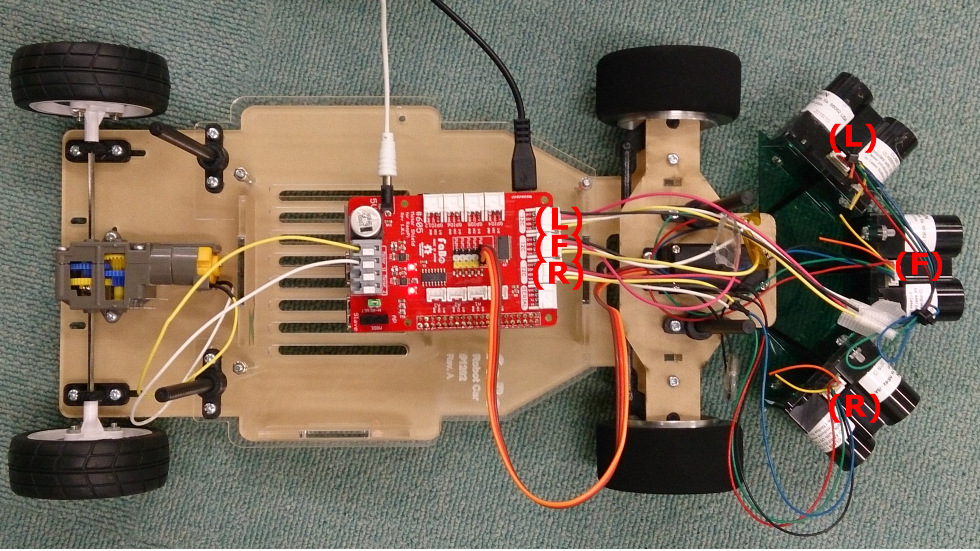
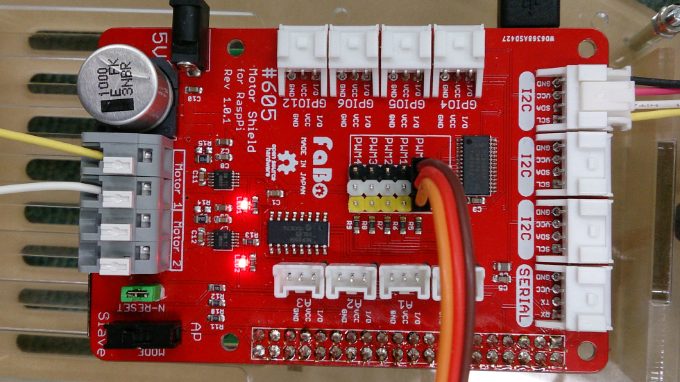
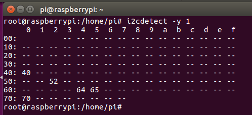
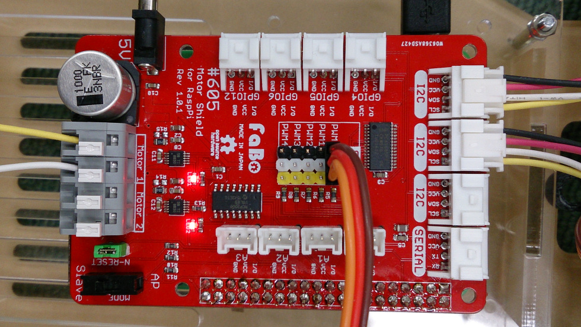
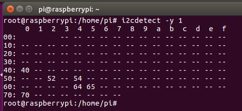
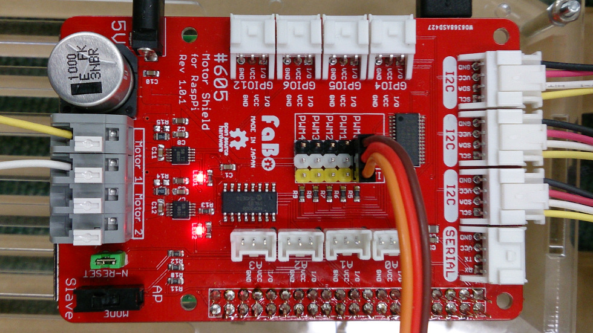

# LidarLite v3 接続

距離センサーLidarLite v3を3個使って前方障害物までの距離を計測します。

LidarLite v3はすべて同一のアドレス0x62になるため、1本ずつ接続してアドレスを変更する必要があります。(L:0x52、F:0x54、R:0x56。値取得時にアドレスを指定する。)この作業はLidarの電源が入る度に必要になります。

完成状態


LidarLiteV3ライブラリ
https://github.com/FaBoPlatform/LidarLiteV3
```
git clone https://github.com/FaBoPlatform/LidarLiteV3
pip install LidarLiteV3/
```

## 1. 左側のLidarをアドレス0x52に変更します
配線

Pythonでアドレス0x62->0x52に変更後、アドレスを確認
```python
import LidarLiteV3
lidar1 = LidarLiteV3.Connect(0x62)
lidar1.changeAddress(0x52)
```

## 2. 中央のLidarをアドレス0x54に変更します

Pythonでアドレス0x62->0x54に変更後、アドレスを確認
```python
import LidarLiteV3
lidar2 = LidarLiteV3.Connect(0x62)
lidar2.changeAddress(0x54)
```

## 3. 右側のLidarをアドレス0x56に変更します

Pythonでアドレス0x62->0x56に変更後、アドレスを確認
```python
import LidarLiteV3
lidar3 = LidarLiteV3.Connect(0x62)
lidar3.changeAddress(0x56)
```


LidarLite v3は奇数番のアドレスには変更できません。

I2Cは本体の電源が入っている状態でも抜き差しが可能です。