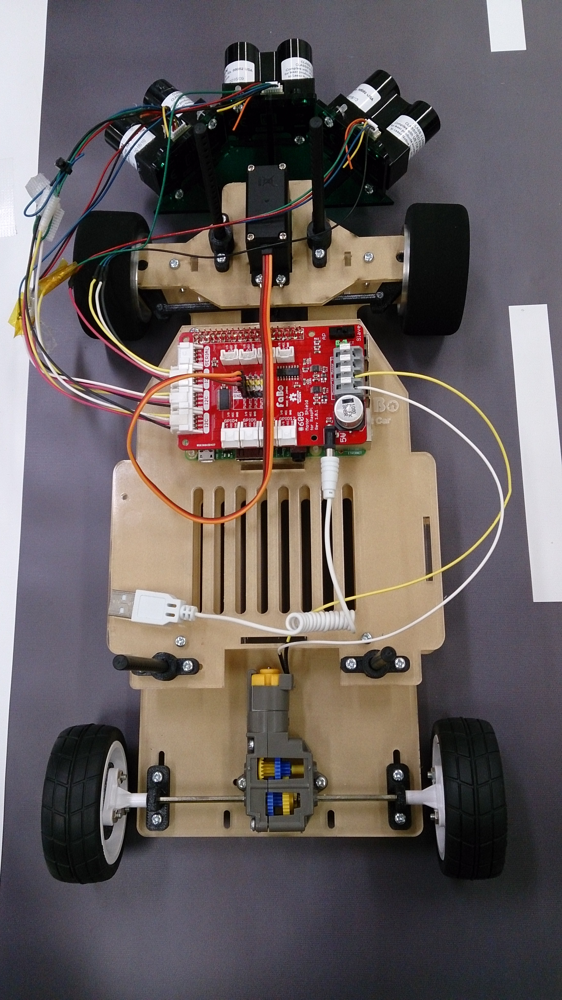
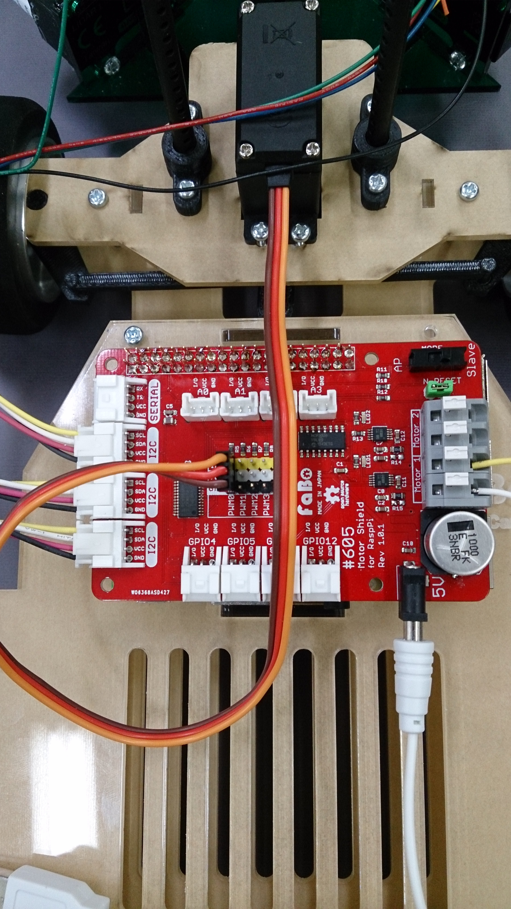
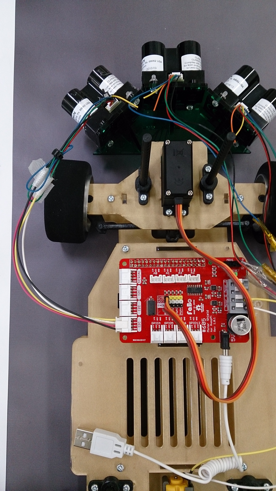
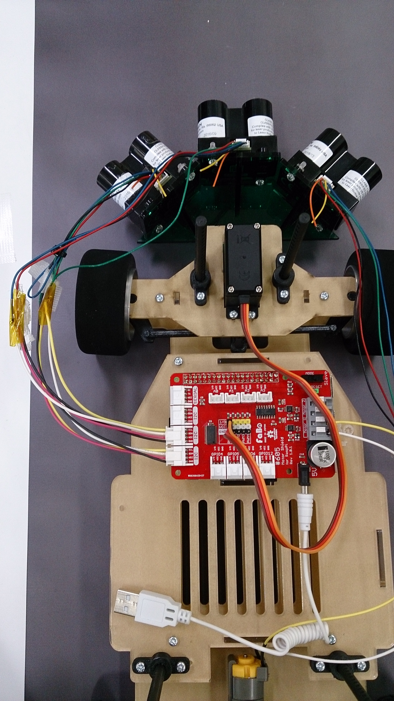

# RoboCarAI - TYPE1 ケルベロス

##### TYPE1

##### TYPE1 ケルベロス材料
* Raspberry Pi3
* Faboシールド
* Lidar Lite v3
* TYPE1 ラジコンカー
  * サーボ
  * モーター

##### 配線

##### Lidar起動
3個搭載するLidar Lite v3はPower on時にすべて同一のアドレスとなるため、個々を識別するために1個ずつ配線し、アドレス変更を行う必要があります。
Power offになると変更したアドレスを失うため、Power on時に毎回行う必要があります。

######[変更方法 ../source2/lidar-read.ipynb](../source2/lidar-read.ipynb)

左Lidarを接続後、アドレスを0x62から0x52に変更する(0x62はLidar Lite v3デフォルト値。他と被らない値に。AI予測コードでアドレス指定して値取得する)

中央Lidarを接続後、アドレスを0x62から0x54に変更する

右Lidarを接続後、アドレスを0x62から0x56に変更する

