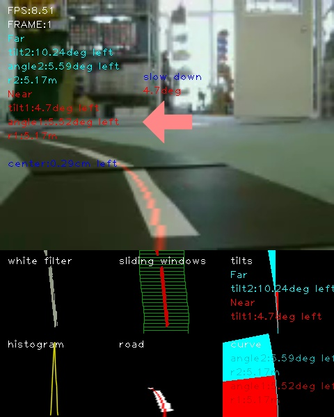

# RobotCarAI

RobotCar AI Playground.

## Level
* [Level 1: Fabo TYPE1 ロボットカー制御](https://github.com/FaBoPlatform/RobotCarAI/tree/master/level1_car/)
* [Level 1: 距離センサーの値をニューラルネットワークで使う](https://github.com/FaBoPlatform/RobotCarAI/tree/master/level1_sensors/)
* [Level 1: ロボットカー走行デモ](https://github.com/FaBoPlatform/RobotCarAI/tree/master/level1_demo/)
* [Level 2: OpenCVでラインを検出する](https://github.com/FaBoPlatform/RobotCarAI/tree/master/level2_lane_detection/)
* [Level 2: ロボットカー走行デモ TCP通信版](https://github.com/FaBoPlatform/RobotCarAI/tree/master/level2_demo_socket)
* [Level 3: ニューラルネットワークで道路標識を検出する](https://github.com/FaBoPlatform/RobotCarAI/tree/master/level3_object_detection)
* [Level 3: ロボットカー走行デモ TCP通信版](https://github.com/FaBoPlatform/RobotCarAI/tree/master/level3_demo_socket)
* [Level 3: ロボットカー走行デモ FFMPEG UDP Streaming/TCP通信版](https://github.com/FaBoPlatform/RobotCarAI/tree/master/level3_demo_streaming)
* [Level 4: OpenCVでレーンを検出する](https://github.com/FaBoPlatform/RobotCarAI/tree/master/level4_lane_detection)

#### Level 1
 

#### Level 2
 

#### Level 3
 

#### Level 4
 

## Component
* [FaBo](http://fabo.io)
* [FaBo Open Source Robot Car](https://github.com/FaBoPlatform/RobotCar)

## Tutorial

* [TensorFlow Docs](http://docs.fabo.io/tensorflow/)