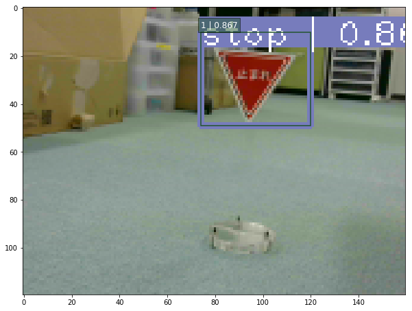

# SSD: Single Shot MultiBox Detection

TensorFlowを使った物体検出として、Balancap SSD-Tensorflowを用いて道路標識を学習し、Jetson TX2で実行してみます。

[止まれを認識する動画](./media/stop.avi)

[コースを走行しながら認識する動画](./media/course160x120.avi)


Balancap SSD-Tensorflowはこちら:
[https://github.com/balancap/SSD-Tensorflow](https://github.com/balancap/SSD-Tensorflow)


##### 本ディレクトリをダウンロードしたら、shスクリプトに実行権限を与えます
```
chmod 755 install_scripts/*.sh
chmod 755 train_scripts/*.sh
```
##### shスクリプトにはインストール先のパスが設定されているので、環境に合わせて修正してください。

##### 道路標識の学習データとなるroadsign_dataをどこかに置きます。  
shスクリプトのパスに合わせて置き場所を決めてください。
```
mv roadsign_data /notebooks/
```

##### Balancap SSD-Tensorflowのgit cloneからバグ修正まで
```
./install_scripts/install_balancap_ssd-tensorflow.sh
./install_scripts/setup_bugfix.sh
```


##### 学習用コードの修正、データ変換
```
./train_scripts/setup_mytrain.sh
./train_scripts/convert_PascalVOC_to_TF-Records.sh
```

##### 学習
```
./train_scripts/train_ssh.sh
```
checkpointへの保存は一定時間毎に行われるようです。


##### 途中のチェックポイントから学習を再開する
```
./train_scripts/train_ssd_continue.sh
```

動作確認は
[https://github.com/balancap/SSD-Tensorflow/blob/master/notebooks/ssd_notebook.ipynb](https://github.com/balancap/SSD-Tensorflow/blob/master/notebooks/ssd_notebook.ipynb)
を参考に。

#####FFMPEG UDP Streamingを使う場合。  
送信側コマンド(192.168.0.77は受信側アドレス)
```
ffmpeg -thread_queue_size 1024 -r 30 -video_size 160x120 -input_format yuyv422 -i /dev/video0 -pix_fmt yuv422p -threads 4 -f mpegts udp://192.168.0.77:8090
```
受信側確認コマンド(受信を確認したらffplayを終了してください。)
```
ffplay udp://localhost:8090
```
##### Balancap SSD-Tensorflowを用いた判定を動画に保存する例。  
ssd_webcam_streaming.ipynbをコピーしてjupyterで開いて実行します。  
パスはgit cloneした場所に合わせて変更してください。
```
cp ./notebooks/ssd_webcam_streaming.ipynb /notebooks/github/SSD-Tensorflow/notebooks/
```


##### 学習データの作り方
Balancap SSD-TensorflowはPascal VOCデータ形式のみ対応なので、
[https://github.com/tzutalin/labelImg](https://github.com/tzutalin/labelImg)
を使って画像のラベルデータを作成します。
```
chmod 755 ./gui_labelimg/install_labelimg.sh
./gui_labelimg/install_labelimg.sh
```
GUIツールなので画面のあるマシンで学習データ作成を行ってください。  
TF-Recordへのコンバート時は画像ファイルをJPEGImagesに、ラベルファイルをAnnotationsに分けます  
画像データ:/notebooks/roadsign_data/PascalVOC/JPEGImages/  
ラベルデータ:/notebooks/roadsign_data/PascalVOC/Annotations/  

学習データを作ったら、学習用コードの修正、データの変換を行ってから学習を行います。  
##### 自前のデータの場合は、各スクリプト上部にあるパスやラベル名を修正してください。  
学習用コードの修正、データ変換、学習
```
./train_scripts/setup_mytrain.sh
./train_scripts/convert_PascalVOC_to_TF-Records.sh
./train_scripts/train_ssh.sh
```

Balancap SSD-Tensorflowではjpegしか扱えないため、pngで画像を用意した場合は変換が必要になります。  
```
apt-get install imagemagick
# png to jpeg
for i in *.png ; do convert "$i" "${i%.*}.jpg" ; done
# replace xml
find ./ -name "*.xml" | xargs sed -i 's/\.png/.jpg/g'
```

学習データとなるroadsign_dataのラベル作成が途中までしか進んでいないので、全ての画像のラベルを作成して学習すると認識率が向上するかもしれません。