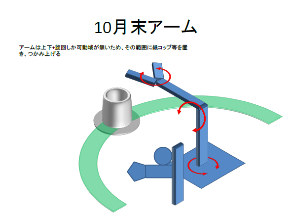

# RobotARM プロトタイプ10月末

#### 固定カメラで、手動でオブジェクトを置いて、RobotARMで掴む
###### スケジュール
 * 10月16-20: Raspberry Pi3でRobotARMアーム動作パターン作成、CNN学習
 * 10月23-27: PWM基板到着、Jetson TX2でのRobotARM動作確認
 * 10月27: プロトタイプ完了
 * 10月30-31: 社内デモ、今月作業で残った問題点のリストアップ

