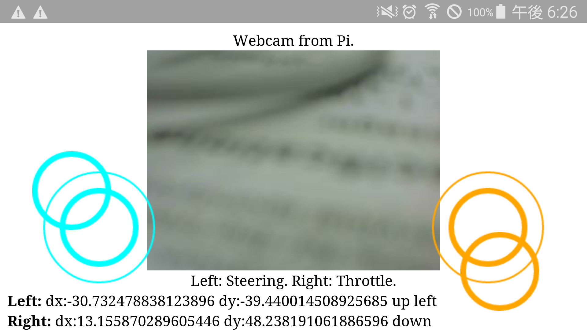

<a name='top'>

【タイトル】
# FaboDrive：Webコントローラ/API
<hr>

【目標】
#### Webブラウザから制御する/プログラムから制御する

【画像】


【実行環境】
* Fabo TYPE1 ロボットカー
  * Fabo #605 Motor Shield Raspberry Pi Rev 1.0.1
  * Fabo #902 Kerberos ver 1.0.0
  * Fabo #1202 Robot Car Rev. 1.0.1
  * Tower Pro SG90
  * Raspberry Pi3
    * Stretch Lite or Jessie Lite
    * docker
      * Ubuntu
      * Python 2.7
      * FaBoPWM-PCA9685-Python
      * FaBoGPIO-PCAL6408-Python

<hr>

<a name='0'>

【Webコントローラ】
* [実行方法](#a)

【API】
* [制御API](#1)

【その他】
* [トラブルシューティング](#2)
* [ディレクトリとファイルについて](#3)
<hr>

<a name='a'>

## 実行方法
#### 1. ロボットカーのRaspberry Pi3にsshでログインします
USER:pi<br>
PASSWORD:raspberry<br>
> `ssh pi@192.168.xxx.xxx`<br>

#### 2. rootになってdockerコンテナIDを調べます
> `sudo su`<br>
> `docker ps -a`<br>
>> CONTAINER ID        IMAGE                      COMMAND                  CREATED             STATUS              PORTS               NAMES<br>
>> da6ea200cd4e        naisy/fabo-jupyter-armhf   "/bin/bash -c 'jupyt…"   8 minutes ago       Up 8 minutes                            confident_lalande<br>

STATUSがUpになっているコンテナIDをメモします。<br>
STATUSがExitedになっている場合は、`docker start CONTAINER_ID`で起動します。
> `docker start da6ea200cd4e`<br>

#### 3. dockerコンテナにログインします
docker exec -it CONTAINER_ID /bin/bash<br>
> `docker exec -it da6ea200cd4e /bin/bash`<br>

CONTAINER_IDにはベースイメージがnaisy/fabo-jupyter-armhfのda6ea200cd4eを使います。<br>

#### 4. FaboDriveのディレクトリに移動します

> `cd /notebooks/github/RobotCarAI/fabodrive/`<br>
> `ls`<br>
>> total 32<br>
>> 388005 4 ./   388006 8 controller.py  521077 4 lib/     655069 4 templates/<br>
>> 254266 4 ../  388007 4 fabolib/       521080 4 static/<br>

#### 5. FaboDriveを起動します
###### USBカメラを使う場合<br>
> `python controller.py --use-usb`<br>
###### Piカメラを使う場合<br>
> `python controller.py`<br>

#### 6. スマホのブラウザでアクセスします
> http://192.168.xxx.xxx:8080<br>

タッチパッド対応しているAndroid/iOSは左右の仮想ジョイスティックで操作出来ます。<br>
ただし、iOSの場合は2本指で拡大縮小になるため、1本指を置いて2秒程待ってから2本指で操作してください。<br>

タッチパッドに対応していないPCはASDWキーで操作できます。<br>

ブラウザでのアクセス中は秒間10回、車両制御命令を送り続けます。

#### 7. 終了
Ctrl + c でcontroller.pyを終了します

[<ページTOP>](#top)　[<目次>](#0)
<hr>

<a name='1'>

## 制御API
Webコントローラは制御APIを搭載しています。<br>
非常にシンプルなAPIで、GETメソッドとPOSTメソッドにのみ対応しています。<br>

パラメータ | 単位 | 可能範囲 | 用途
-- | -- | -- | --
angle | float型 degree | -45 to 45 | ステアリング制御
speed | float型 | -100 to 100 | モーター制御

angleはラジアンではなく、度になります。<br>
angleはマイナスが右、プラスが左になります。<br>
speedはマイナスが後進、プラスが前進になります。<br>
speedは前進後進を切り替える場合は、モーターの回転が止まるのを待ってから切り替えてください。<br>

#### 使用例

操作 | URL | メソッド
-- | -- | --
停止 | http://192.168.xxx.xxx:8080/drive?angle=0&speed=0 | GET/POST
前進(speed = 50) | http://192.168.xxx.xxx:8080/drive?angle=0&speed=50 | GET/POST
後進(speed = -50) | http://192.168.xxx.xxx:8080/drive?angle=0&speed=-50 | GET/POST
右 | http://192.168.xxx.xxx:8080/drive?angle=-40&speed=50 | GET/POST
左 | http://192.168.xxx.xxx:8080/drive?angle=40&speed=50 | GET/POST

GETも対応しているので、ブラウザのURLでも試すことが出来ます。

[<ページTOP>](#top)　[<目次>](#0)
<hr>

<a name='2'>

## トラブルシューティング
*【発生したエラー】
`python controll.py`実行時に、以下のエラーが出る。
```
Traceback (most recent call last):
  File "/notebooks/github/fabodrive/fabolib/servo.py", line 45, in __init__
    self.PCA9685 = Fabo_PCA9685.PCA9685(self.bus,init_analog)
  File "/usr/local/lib/python2.7/dist-packages/Fabo_PCA9685/PCA9685.py", line 153, in __init__
    self.bus.write_byte_data(self.PCA9685_ADDRESS,self.ALL_LED_ON_L,0x00)
IOError: [Errno 121] Remote I/O error
Exception IOError: (121, 'Remote I/O error') in <bound method PCA9685.__del__ of <Fabo_PCA9685.PCA9685.PCA9685 object at 0x76430a10>> ignored
Traceback (most recent call last):
  File "controller.py", line 36, in <module>
    motor.stop()
  File "/notebooks/github/fabodrive/fabolib/motor.py", line 78, in stop
    self.bus.write_byte_data(self.MOTOR_ADDRESS,self.COMMAND0,self.STOP) #モータへの電力の供給を停止(惰性で動き続ける)
IOError: [Errno 121] Remote I/O error
```
*【原因】
Fabo #605のPWM制御を行うPCA9685チップのアドレスが見つからない。

*【解決策】
Fabo #605に電源ケーブルを接続して、dockerコンテナを再起動する。
i2cが利用可能であることを確認する。
dockerコンテナ内で実行：
```
i2cdetect -y 1
```
正常な出力
```
     0  1  2  3  4  5  6  7  8  9  a  b  c  d  e  f
00:          -- -- -- -- -- -- -- -- -- -- -- -- -- 
10: -- -- -- -- -- -- -- -- -- -- -- -- -- -- -- -- 
20: 20 -- -- -- -- -- -- -- -- -- -- -- -- -- -- -- 
30: -- -- -- -- -- -- -- -- -- -- -- -- -- -- -- -- 
40: 40 -- -- -- -- -- -- -- -- -- -- -- -- -- -- -- 
50: -- -- -- -- -- -- -- -- -- -- -- -- -- -- -- -- 
60: -- -- -- 63 64 -- -- -- -- -- -- -- -- -- -- -- 
70: 70 -- -- -- -- -- -- --                         
```

[<ページTOP>](#top)　[<目次>](#0)
<hr>

<a name='3'>

## ディレクトリとファイルについて
* ディレクトリについて
  * document/ ドキュメント関連
  * fabolib/ Fabo製基板関連
  * lib/ SPIライブラリ
  * templates/ HTMLテンプレートファイル
  * static/ JavaScript
* ファイルについて
  * README.md このファイル
  * controller.py ブラウザからの制御とAPI

[<ページTOP>](#top)　[<目次>](#0)
<hr>


