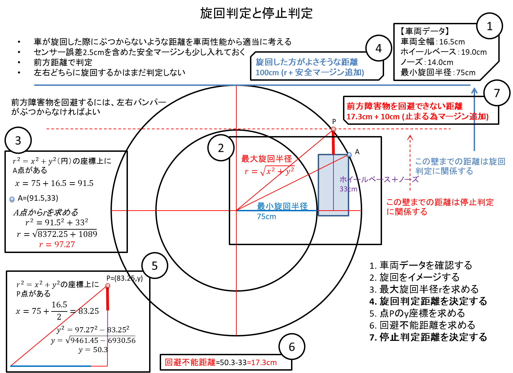

<a name='top'>

【タイトル】
# レベル1：距離センサーの値をニューラルネットワークで使う
<hr>

【目標】
#### 3つの距離センサーから値を取得し、ロボットカーが走行可能な進行方向をニューラルネットワークモデルを用いて予測する

【画像】

必要になるもの
* Raspberry Pi3
* Fabo #605 Motor Shield Raspberry Pi Rev 1.0.1
* Fabo #902 Kerberos ver 1.0.0
* LidarLite v3
* USB電源

<hr>

<a name='0'>

【目次】
* [Hardware] [距離センサーLidarLite v3について](#1)
  * 取得できる距離、値、誤差、測定周期
* [Neural Networks] [学習データのフォーマットについて](#2)
  * クラス分類
  * one hot value
  * データフォーマット
* [Python] [学習データ ジェネレータを作る](#3)
  * 簡単なIF文での判定
  * 車両旋回性能
  * 曲がる、止まる判定
* [Neural Networks] [学習モデルについて](#4)
  * Multi-Layer Perceptron
* [Python/TensorFlow] [学習用コードのコーディング](#5)
  * 学習コード設計
* [Python/TensorFlow] [学習と保存](#6)
  * 学習実行
  * 保存と読み込み
* [Python/TensorFlow] [予測を実行](#7)
* [Python/TensorFlow] [予測精度を評価](#8)
* [ディレクトリとファイルについて](#9)
<hr>

<a name='1'>

## [Hardware] 距離センサーLidarLite v3について
CLASS1 LASERで距離を計測する機器。
#### 取得できる距離、値、誤差、測定周期
  * 測定可能距離は40m
  * cm単位の整数値で取得
  * 測定誤差は5m以内で2.5cm、5m以上で10cm
  * 測定周期は50Hz=0.02秒間隔

仕様書：[https://static.garmin.com/pumac/LIDAR_Lite_v3_Operation_Manual_and_Technical_Specifications.pdf](https://static.garmin.com/pumac/LIDAR_Lite_v3_Operation_Manual_and_Technical_Specifications.pdf)

[<ページTOP>](#top)　[<目次>](#0)
<hr>

<a name='2'>

## [Neural Networks] 学習データのフォーマットについて
#### クラス分類
ロボットカーの進行方向の予測は、STOP,LEFT,FOWARD,RIGHTのどれか一つに属します。これを一般的にクラス分類と呼びます。<br>
画像認識では、用意したクラスのどれにも属さないことを表すためにその他クラスも用意しますが、今回のセンサー値を入力値としたロボットカーの進行方向予測では、その他は存在しないものと考えます。
<hr>

#### one hot value
Neural Networksでは予測結果を確率で算出するため、全てのクラスの確率の和を1にします。<br>
クラス分類では、入力値はどれか一つのクラスに属するため、そのクラスだけを1に、他のクラスを0にした正解ラベルを用意します。これを一般的にone hot valueと呼びます。

クラス分類 | STOP | LEFT | FOWARD | RIGHT
-- | -- | -- | -- | --
label0 | 1 | 0 | 0 | 0
label1 | 0 | 1 | 0 | 0
label2 | 0 | 0 | 1 | 0
label3 | 0 | 0 | 0 | 1

pythonでは、numpyを使ってone hot valueを作ることが出来ます。
```python
# coding: utf-8
import numpy as np
n_classes = 4 # クラス分類の総数
########################################
# ラベル番号をone_hot_valueに変換する
########################################
def get_one_hot_value(int_label):
    one_hot_value = np.zeros((1,n_classes))
    one_hot_value[np.arange(1),np.array([int_label])] = 1
    return one_hot_value

for i in range(n_classes):
    one_hot_value = get_one_hot_value(i)
    print("label:{} one_hot_value:{}".format(i,one_hot_value))
```
> label:0 one_hot_value:[[ 1.  0.  0.  0.]]<br>
> label:1 one_hot_value:[[ 0.  1.  0.  0.]]<br>
> label:2 one_hot_value:[[ 0.  0.  1.  0.]]<br>
> label:3 one_hot_value:[[ 0.  0.  0.  1.]]<br>

今回は学習データ ジェネレータの分岐バグチェックを兼ねてone hot valueを作るのでこのコードは出てきませんが、画像認識などでデータがすでにあり、ラベル付けを別途行わなければならない場合に使います。
<hr>

#### データフォーマット
距離センサーを3個使うので入力値は3つ、出力値はone hot valueで表すので4つとなり、学習データのフォーマットはCSVで表すと以下のようになります。<br>
```csv
#left_sensor,front_sensor,right_sensor,stop,left,foward,right
0,0,0,1,0,0,0
200,200,50,0,1,0,0
200,200,200,0,0,1,0
50,200,200,0,0,0,1
```
[<ページTOP>](#top)　[<目次>](#0)
<hr>

<a name='3'>

## [Python] 学習データ ジェネレータを作る
学習データフォーマットが決まったので、実際に学習データを作っていきます。<br>
CSVデータを人力で用意していってもよいのですが、IF文で書ける分岐条件なので関数で書いてしまうことにします。<br>
<hr>

<a name='3-1'>

#### 簡単なIF文での判定
```python
# coding: utf-8
import numpy as np
class LabelGenerator():
    def get_label(self,sensors):
        '''
        sensors: [左センサー値,前センサー値,右センサー値]
        '''

        if sensors[0] < 50: # 前方に空きが無い
            return [1,0,0,0] # STOP
        elif sensors[1] < 50: # 左に空きが無い
            return [0,0,0,1] # RIGHT
        elif sensors[2] < 50: # 右に空きが無い
            return [0,1,0,0] # LEFT
        else: # 全方向に空きがある
            return [0,0,1,0] # FOWARD

generator = LabelGenerator()
n_rows = 10 # 作成するデータ件数
sensors = np.random.randint(0,200,[n_rows,3]) # 範囲0-200の値で3つの値を持つ配列をミニバッチ個作る
print("--- sensors ---\n{}".format(sensors))
csvdata=[]
for i in range(n_rows):
    generator_result = generator.get_label(sensors[i])
    csvrow = np.hstack((sensors[i],generator_result))
    csvdata.append(csvrow)
csvdata = np.array(csvdata)
print("--- batch data ---\n{}".format(csvdata))
```
>--- sensors ---<br>
> [[123  76 172]<br>
>  [ 12  74  98]<br>
>  [ 52  59  45]<br>
>  [ 51 137 147]<br>
>  [  8  45  58]<br>
>  [ 87 176 189]<br>
>  [183  34 197]<br>
>  [115   4 100]<br>
>  [108 154 136]<br>
>  [140  53 101]]<br>
> --- batch data ---<br>
> [[123  76 172   0   0   1   0]<br>
>  [ 12  74  98   1   0   0   0]<br>
>  [ 52  59  45   0   1   0   0]<br>
>  [ 51 137 147   0   0   1   0]<br>
>  [  8  45  58   1   0   0   0]<br>
>  [ 87 176 189   0   0   1   0]<br>
>  [183  34 197   0   0   0   1]<br>
>  [115   4 100   0   0   0   1]<br>
>  [108 154 136   0   0   1   0]<br>
>  [140  53 101   0   0   1   0]]<br>

<hr>

#### 車両旋回性能
[簡単なIF文での判定](#3-1)で学習データ ジェネレータは出来たも当然ですが、実際の車両の旋回性能に合わせたカスタマイズがあってもよいかもしれません。そこで、車両がどのように旋回するのかを考慮してみます。<br>
(実際のところ、定常円を描けなかったり左右で旋回半径が異なったりする車両の足回りでは計算通りの旋回にならないので走行具合をみて調整が必要になります。)<br>
<hr>

車両の旋回は、リアタイヤの車軸の延長線上に円の中心が来ることから、旋回イメージを図に描いてみます。

図に描いてみると、避けきれない前方障害物(点P)の存在も見えてきます。
<hr>

車両データを実測します。<br>
赤い#1202,#605,#103,#902はFabo製プロトタイピング用基板。

ホイールベースとノーズは個別に使うことはしていないので、単純に全長と考えてよいです。
<hr>

車両データを旋回イメージに当てはめます。

<hr>


#### 曲がる、止まる判定
車両の旋回イメージが出来たので、旋回に入る距離と、旋回しても回避出来ないため停止と判断する距離を算出します。

止まる為に用意した10cmマージンは、車両制御コード側で前方障害物までの距離を元に速度調整を入れたため、実際の学習データ ジェネレータのコードでは10cmマージンを削除してあります。
<hr>

旋回方向は左右のより空いている方向に曲がればよいのですが、左右どちらにも壁があり曲がれないことも考慮します。

分岐パターンを適当に決めます。3つの距離センサー値はそれぞれ以下の3パターンで考えることが出来ます。
* パターン0： 障害物までの距離が遠いため、制御不要
* パターン1： 障害物までの距離が近いため、制御必要
* パターン2： 障害物までの距離が近すぎるため、その方向には進めない

左前右センサー値をそれぞれこのパターンのどれにあたるのかをIF文で判断し、次に進行方向を決定するための分岐を作成します。
* コントロール1：前2 - 直進も旋回も出来ないため停止する
* コントロール分岐：左01,前1,右01 - 前方障害物あり。左右旋回可能。左右の距離が遠い方に曲がる
  * コントロール2：右の方が距離が遠い場合。右に曲がる
  * コントロール3：左の方が距離が遠い場合。左に曲がる
* コントロール4：右0前0左0 - 制御不要のため、直進する
* コントロール5：左12右0 - 左は障害物までの距離が近いか近すぎるため、右に曲がる
* コントロール6：左0右12 - 右は障害物までの距離が近いか近すぎるため、左に曲がる
* コントロール7：左2右2 - 左も右も旋回不可能。前方はコントロール1を通過しているので進行可能。直進するが、もしかしたら壁にぶつかる可能性もある
* コントロール分岐：左1右1 - 左右どちらも障害物に近いので、真ん中になるように幅調整をする
  * コントロール8：右の方が距離が遠い場合。右に曲がる
  * コントロール9：左の方が距離が遠い場合。左に曲がる
* コントロール10：左2右1 - 左は障害物までの距離が近すぎるため、右に曲がる
* コントロール11：左1右2 - 右は障害物までの距離が近すぎるため、左に曲がる

制御分岐を通ったら[簡単なIF文での判定](#3-1)と同様にone hot valueで値を返して学習データ ジェネレータは完成です。<br>

ラベル ジェネレータ：[./generator/labelgenerator.py](./generator/labelgenerator.py)<br>
学習データ ジェネレータ：[./MLP/train_model.py](./MLP/train_model.py)<br>
```python
def generate_random_train_data(n_rows):
    '''
    ランダムなセンサー値と、それに対応するラベルデータを作成する
    args:
        n_rows: 作成するデータ件数
    return:
        batch_data: センサー値
        batch_target: ラベルデータ
    '''
    csvdata=[]
    # 2m以内のランダムなINT値を作成する
    sensors = np.random.randint(0,200,[n_rows,DATA_COLS])

    for i in range(n_rows):
        generator_result = generator.get_label(sensors[i])
        csvrow = np.hstack((sensors[i],generator_result))
        csvdata.append(csvrow)
    csvdata = np.array(csvdata)

    batch_data = csvdata[0:n_rows,0:DATA_COLS]
    batch_target = csvdata[0:n_rows,DATA_COLS:]
    return batch_data, batch_target
```
<hr>

<a name='4'>

## [Neural Networks] 学習モデルについて
学習モデルはシンプルなMulti-Layer Perceptronで作成します。
#### Multi-Layer Perceptron

入力層はセンサー値を入れるため3入力を持ちます。<br>
隠れ層は1つだけ持ち、11ノードを用意します。各ノードは3つのセンサー値を入力に持ちます。<br>
隠れ層と出力層では全ての入力線で個別にweightを持ち、各ノード毎にbiasを持ちます。<br>
Neural Networksではこのweightとbiasの値が学習成果となり、ノードの形をモデルと呼びます。値とモデル構図が分かれていることは主に学習途中からの再開時(checkpointからの値のrestore)や、学習成果を凍結する時(ノード情報と値をpbファイルに保存。freeze graph)に現れます。

[<ページTOP>](#top)　[<目次>](#0)
<hr>

<a name='5'>

## [Python/TensorFlow] 学習用コードのコーディング
#### 学習コード設計
* 簡単かつスケール増減が単純なMulti-Layer Perceptronモデルとする
* 学習データ ジェネレータを作成する
* 実装はミニバッチでおこなう
* 学習データ処理には分散処理が可能なqueueを用いる
* 予測時に用いる入出力オペレーションには名前を付ける
* ステップ数を記録する
* checkpoint保存と途中から再開する
* Tensorboard用にsummary出力する
* 定数の変数は大文字にする

ミニバッチとは、学習時に特徴量を算出しやくするために、学習データを10～100個程度に小分けにしたものになります。<br>
1つのミニバッチデータには各クラスが同数含まれている方が精度が良くなりますが、今回は気にしないことにします。
<hr>


<hr>

センサー値の入力変数はplaceholder_input_dataとdequeue_input_dataの2種類あります。<br>
予測実行時のセンサー値の入力変数はdequeue_input_dataとなるオペレーション名dequeue_op:0を使います。<br>
学習コード：[./MLP/train_model.py](./MLP/train_model.py)
```python
    dequeue_input_data, dequeue_input_target = queue.dequeue_many(placeholder_batch_size, name='dequeue_op') # instead of data/target placeholder
```
<hr>

ミニバッチサイズを可変とするためにplaceholderを使い、行数をNoneとしています。<br>
学習コード：[./MLP/train_model.py](./MLP/train_model.py)
```python
placeholder_input_data = tf.placeholder('float', [None, DATA_COLS], name='input_data') # for load_and_enqueue. use dequeue_op:0 for prediction
```
<hr>

placeholderの行数をNoneとすることで、1つの値を予測するためであっても予測にかけるデータは配列に入れる必要が生じますが([[左センサー値,前センサー値,右センサー値]])、学習時のミニバッチサイズと予測時のデータ件数は異なるため、入力変数に使うplaceholderの行数はNoneとすることで、モデルで可変行数の入力値を扱えるようにします。<br>
予測実行コード：[./MLP/run_ai_test.py](./MLP/run_ai_test.py)
```python
        # センサー値をランダムな0-1000の範囲で作成する
        # sensors = [[LEFT45,FRONT,RIGHT45]]
        sensors = np.array([np.random.randint(0,1000,3)])

        # 予測を実行する
        _output_y,_score = sess.run([output_y,score],feed_dict={input_x:sensors})
```

[<ページTOP>](#top)　[<目次>](#0)
<hr>

<a name='6'>

## [Python/TensorFlow] 学習と保存
#### 学習実行
> cd ./MLP/<br>
> python train_model.py<br>

学習はTARGET_STEPまで学習を行います。<br>
学習コード：[./MLP/train_model.py](./MLP/train_model.py)
```python
TARGET_STEP = 10000 # ステップ数
```
今回はステップ数もモデルに変数として保存しているので、途中から再開してもTARGET_STEPまで学習したらそこで終了します。<br>
TARGET_STEPを増やすことで、さらに学習させることが出来ます。
<hr>

#### 保存と読み込み
保存と読み込みには2種類の方法があります。
* 再学習可能な方法
  * checkpointに保存
  * checkpointを読み込む
* 凍結する方法
  * pbファイルに保存
  * pbファイルを読み込む

checkpointで保存すると、学習・実行に必要な全てのモデル構成と変数値が保存されます。そのため、checkpointを読み込むことで学習を再開することが出来ます。<br>
checkpointでは、モデル構成と変数値はそれぞれ別のファイルに保存されます。<br>

pbファイルで保存すると、予測に必要なオペレーション名だけを指定してモデル構成と変数値を保存することが出来ます。そのため、再学習に用いることは出来ませんが、バイナリサイズは小さくなります。<br>
pbファイルでは変数値を定数に変換しモデル構成の中に埋め込みます。

step pbファイル変換前
```
step/input_step [<tf.Tensor 'step/input_step:0' shape=<unknown> dtype=int32>]
step/step/initial_value [<tf.Tensor 'step/step/initial_value:0' shape=() dtype=int32>]
step/step [<tf.Tensor 'step/step:0' shape=() dtype=int32_ref>]
step/step/Assign [<tf.Tensor 'step/step/Assign:0' shape=() dtype=int32_ref>]
step/step/read [<tf.Tensor 'step/step/read:0' shape=() dtype=int32>]
step/Assign [<tf.Tensor 'step/Assign:0' shape=() dtype=int32_ref>]
```
step pbファイル変換後
```
prefix/step/step [<tf.Tensor 'prefix/step/step:0' shape=() dtype=int32>]
```

neural_network_model/Variable_1 pbファイル変換前
```
neural_network_model/Variable_1 [<tf.Tensor 'neural_network_model/Variable_1:0' shape=(3, 11) dtype=float32_ref>]
neural_network_model/Variable_1/IsVariableInitialized [<tf.Tensor 'neural_network_model/Variable_1/IsVariableInitialized:0' shape=() dtype=bool>]
neural_network_model/Variable_1/cond/Switch [<tf.Tensor 'neural_network_model/Variable_1/cond/Switch:0' shape=() dtype=bool>, <tf.Tensor 'neural_network_model/Variable_1/cond/Switch:1' shape=() dtype=bool>]
neural_network_model/Variable_1/cond/switch_t [<tf.Tensor 'neural_network_model/Variable_1/cond/switch_t:0' shape=() dtype=bool>]
neural_network_model/Variable_1/cond/switch_f [<tf.Tensor 'neural_network_model/Variable_1/cond/switch_f:0' shape=() dtype=bool>]
neural_network_model/Variable_1/cond/pred_id [<tf.Tensor 'neural_network_model/Variable_1/cond/pred_id:0' shape=() dtype=bool>]
neural_network_model/Variable_1/cond/read/Switch [<tf.Tensor 'neural_network_model/Variable_1/cond/read/Switch:0' shape=(3, 11) dtype=float32_ref>, <tf.Tensor 'neural_network_model/Variable_1/cond/read/Switch:1' shape=(3, 11) dtype=float32_ref>]
neural_network_model/Variable_1/cond/read [<tf.Tensor 'neural_network_model/Variable_1/cond/read:0' shape=(3, 11) dtype=float32>]
neural_network_model/Variable_1/cond/Switch_1 [<tf.Tensor 'neural_network_model/Variable_1/cond/Switch_1:0' shape=(3, 11) dtype=float32>, <tf.Tensor 'neural_network_model/Variable_1/cond/Switch_1:1' shape=(3, 11) dtype=float32>]
neural_network_model/Variable_1/cond/Merge [<tf.Tensor 'neural_network_model/Variable_1/cond/Merge:0' shape=(3, 11) dtype=float32>, <tf.Tensor 'neural_network_model/Variable_1/cond/Merge:1' shape=() dtype=int32>]
neural_network_model/Variable_1/neural_network_model/Variable/read_neural_network_model/Variable_1_0 [<tf.Tensor 'neural_network_model/Variable_1/neural_network_model/Variable/read_neural_network_model/Variable_1_0:0' shape=(3, 11) dtype=float32>]
neural_network_model/Variable_1/Assign [<tf.Tensor 'neural_network_model/Variable_1/Assign:0' shape=(3, 11) dtype=float32_ref>]
neural_network_model/Variable_1/read [<tf.Tensor 'neural_network_model/Variable_1/read:0' shape=(3, 11) dtype=float32>]

neural_network_model/Variable_1/Adam/Initializer/zeros [<tf.Tensor 'neural_network_model/Variable_1/Adam/Initializer/zeros:0' shape=(3, 11) dtype=float32>]
neural_network_model/Variable_1/Adam [<tf.Tensor 'neural_network_model/Variable_1/Adam:0' shape=(3, 11) dtype=float32_ref>]
neural_network_model/Variable_1/Adam/Assign [<tf.Tensor 'neural_network_model/Variable_1/Adam/Assign:0' shape=(3, 11) dtype=float32_ref>]
neural_network_model/Variable_1/Adam/read [<tf.Tensor 'neural_network_model/Variable_1/Adam/read:0' shape=(3, 11) dtype=float32>]
neural_network_model/Variable_1/Adam_1/Initializer/zeros [<tf.Tensor 'neural_network_model/Variable_1/Adam_1/Initializer/zeros:0' shape=(3, 11) dtype=float32>]
neural_network_model/Variable_1/Adam_1 [<tf.Tensor 'neural_network_model/Variable_1/Adam_1:0' shape=(3, 11) dtype=float32_ref>]
neural_network_model/Variable_1/Adam_1/Assign [<tf.Tensor 'neural_network_model/Variable_1/Adam_1/Assign:0' shape=(3, 11) dtype=float32_ref>]
neural_network_model/Variable_1/Adam_1/read [<tf.Tensor 'neural_network_model/Variable_1/Adam_1/read:0' shape=(3, 11) dtype=float32>]

train_op/update_neural_network_model/Variable_1/ApplyAdam [<tf.Tensor 'train_op/update_neural_network_model/Variable_1/ApplyAdam:0' shape=(3, 11) dtype=float32_ref>]
```

neural_network_model/Variable_1 pbファイル変換後
```
prefix/neural_network_model/Variable_1 [<tf.Tensor 'prefix/neural_network_model/Variable_1:0' shape=(3, 11) dtype=float32>]
prefix/neural_network_model/Variable_1/read [<tf.Tensor 'prefix/neural_network_model/Variable_1/read:0' shape=(3, 11) dtype=float32>]
```

prefixはpb読み込み時に追加した接頭辞<br>
学習コード：[./MLP/run_ai.py](./MLP/run_ai.py)
```python
    with tf.Graph().as_default() as graph:
        tf.import_graph_def(
            graph_def, 
            input_map=None, 
            return_elements=None, 
            name="prefix", 
            op_dict=None, 
            producer_op_list=None
        )
```

<hr>

#### 再利用可能な方法
<hr>

#### checkpointに保存
学習コードで途中経過や学習完了時に保存する時はcheckpointを使います。
```python
saver = tf.train.Saver(max_to_keep=100)
''' 学習を実行 '''
saver.save(sess, MODEL_DIR + '/model-'+str(step)+'.ckpt')
```
checkpointはデフォルトでは最新5件までしか残さないため、長時間の学習を行う時はmax_to_keepの値を指定しておきます。<br>
例えば5000万ステップを学習する場合は、checkpointは100万ステップ毎に保存する感じで使います。<br>

学習コード：[./MLP/train_model.py](./MLP/train_model.py)
```python
            # 1000000 step毎にsaveする
            if step % 1000000 == 0:
                _step = sess.run(step_op,feed_dict={placeholder_step:step}) # variable_stepにstepを記録する
                saver.save(sess, MODEL_DIR + '/model-'+str(step)+'.ckpt')
```
checkpointへの保存で使うsaver.save()は、学習済みの値の他にモデル構成情報となるmeta_graphも出力します。
<hr>

#### checkpointを読み込む
今回は、学習コードにモデルをフルスクラッチで書いているので、checkpointからのモデル情報の復元はスキップして、変数値だけを復元して再開します。<br>
学習コード：[./MLP/train_model.py](./MLP/train_model.py)
```python
saver = tf.train.Saver(max_to_keep=100)
with tf.Session() as sess:
    ckpt = tf.train.get_checkpoint_state(MODEL_DIR)
    if ckpt:
        # checkpointファイルから最後に保存したモデルへのパスを取得する
        last_model = ckpt.model_checkpoint_path
        print("load {}".format(last_model))
        # 学習済みモデルを読み込む
        saver.restore(sess, last_model)
    else:
        print("initialization")
        # 初期化処理
        init_op = tf.global_variables_initializer()
        sess.run(init_op)
```
checkpointがある場合、学習済みの変数値をsaver.restore()で復元します。この時、checkpointのモデル情報と今のモデル情報が一致している必要があります。モデル情報を変更していると復元に失敗します。<br>
checkpointが無い場合は、tf.global_variables_initializer()でモデルの変数値を初期化します。
<hr>

#### 凍結する方法
checkpointから復元した再学習可能なフルモデルデータでも予測は出来ますが、実行環境においては学習でしか使わない情報は無駄なので削り落として必要なものだけをpbファイルに保存したものを使います。<br>
<hr>

#### pbファイルに保存
> cd ./MLP/<br>
> python freeze_graph.py<br>

./MLP/model/car_model.pb ファイルが作成されます。<br>
pbファイル作成コード：[./MLP/freeze_graph.py](./MLP/freeze_graph.py)


学習コードで学習済みモデルのpbファイルを作ろうとすると、学習時のセッションとは別のセッションを作成して変数値を再読み込みしないといけないため、コードを分けて用意します。<br>
<hr>

予測時に使うOP名は、学習コードで付けた名前になります。tf.variable_scope()で名前スコープを付けた場合はスコープ名から必要になります。<br>
学習コード：[./MLP/train_model.py](./MLP/train_model.py)
```python
with tf.variable_scope("queue"):
...
    dequeue_input_data, dequeue_input_target = queue.dequeue_many(placeholder_batch_size, name='dequeue_op') # instead of data/target placeholder
```
pbファイル作成コード：[./MLP/freeze_graph.py](./MLP/freeze_graph.py)
```python
OUTPUT_NODE_NAMES="queue/dequeue_op,neural_network_model/output_y,neural_network_model/score,step/step"
```
ここで名付けたdequeue_opは、予測実行時にdequeue_op:0をセンサー値入力用に使います。dequeue_op:1は正解ラベル用になりますが、予測に使うことはありません。

<hr>

OP名が分からない時は、表示されるOP名から推測してください。<br>
pbファイル作成コード：[./MLP/freeze_graph.py](./MLP/freeze_graph.py)
```python
def print_graph_operations(graph):
    # print operations
    print("----- operations in graph -----")
    for op in graph.get_operations():
        print("{} {}".format(op.name,op.outputs))
...
        # print operations
        print_graph_operations(graph)
```
```
----- operations in graph -----
input/input_data [<tf.Tensor 'input/input_data:0' shape=(?, 3) dtype=float32>]
input/input_target [<tf.Tensor 'input/input_target:0' shape=<unknown> dtype=float32>]
input/batch_size [<tf.Tensor 'input/batch_size:0' shape=<unknown> dtype=int32>]
step/input_step [<tf.Tensor 'step/input_step:0' shape=<unknown> dtype=int32>]
step/step/initial_value [<tf.Tensor 'step/step/initial_value:0' shape=() dtype=int32>]
step/step [<tf.Tensor 'step/step:0' shape=() dtype=int32_ref>]
step/step/Assign [<tf.Tensor 'step/step/Assign:0' shape=() dtype=int32_ref>]
step/step/read [<tf.Tensor 'step/step/read:0' shape=() dtype=int32>]
step/Assign [<tf.Tensor 'step/Assign:0' shape=() dtype=int32_ref>]
```

freeze_graph.pyは、他のモデルのcheckpointでも使うことが出来ます。
<hr>

学習環境と実行環境で異なるマシン環境の場合は、モデル構成情報からデバイス情報を削除します。<br>
pbファイル作成コード：[./MLP/freeze_graph.py](./MLP/freeze_graph.py)
```python
CLEAR_DEVICES=True
...
        # Graphを読み込む
        # We import the meta graph and retrieve a Saver
        saver = tf.train.import_meta_graph(last_model + '.meta', clear_devices=CLEAR_DEVICES)
```
<hr>

freeze_graphにはモデル構成をコードに書いていないため、checkpointからモデルを復元します。<br>
pbファイル作成コード：[./MLP/freeze_graph.py](./MLP/freeze_graph.py)
```python
        # Graphを読み込む
        # We import the meta graph and retrieve a Saver
        saver = tf.train.import_meta_graph(last_model + '.meta', clear_devices=CLEAR_DEVICES)
```
tf.train.import_meta_graph()でモデル構成が復元され、さらにsaverが作成されます。<br>
<hr>

モデル構成を読み込んだら、グラフ定義を取得します。<br>
pbファイル作成コード：[./MLP/freeze_graph.py](./MLP/freeze_graph.py)
```python
        # We retrieve the protobuf graph definition
        graph = tf.get_default_graph()
        graph_def = graph.as_graph_def()
```
<hr>

学習済みの値を復元します。<br>
pbファイル作成コード：[./MLP/freeze_graph.py](./MLP/freeze_graph.py)
```python
        saver.restore(sess, last_model)
```

<hr>

必要な情報だけに削り落とします。<br>
pbファイル作成コード：[./MLP/freeze_graph.py](./MLP/freeze_graph.py)
```python
        # We use a built-in TF helper to export variables to constants
        output_graph_def = graph_util.convert_variables_to_constants(
            sess, # The session is used to retrieve the weights
            graph_def, # The graph_def is used to retrieve the nodes
            OUTPUT_NODE_NAMES.split(",") # The output node names are used to select the usefull nodes
        )
```
<hr>

pbファイルにバイナリデータで保存します。<br>
pbファイル作成コード：[./MLP/freeze_graph.py](./MLP/freeze_graph.py)
```python
        tf.train.write_graph(output_graph_def, MODEL_DIR,
                             FROZEN_MODEL_NAME, as_text=False)
```
as_text=Trueにすると、テキストファイルで保存することが出来ます。

<a name="6-4">

#### pbファイルを読み込む
予測実行コード：[./MLP/run_ai_test.py](./MLP/run_ai_test.py)
```python
def load_graph(frozen_graph_filename):
    # We load the protobuf file from the disk and parse it to retrieve the 
    # unserialized graph_def
    with tf.gfile.GFile(frozen_graph_filename, "rb") as f:
        graph_def = tf.GraphDef()
        graph_def.ParseFromString(f.read())

    # Then, we can use again a convenient built-in function to import a graph_def into the 
    # current default Graph
    with tf.Graph().as_default() as graph:
        tf.import_graph_def(
            graph_def, 
            input_map=None, 
            return_elements=None, 
            name="prefix", 
            op_dict=None, 
            producer_op_list=None
        )
    return graph

graph = load_graph(MODEL_DIR+"/"+FROZEN_MODEL_NAME)
...
with tf.Session(graph=graph) as sess:
```
モデルを読み込む際にname="prefix"でモデル毎にprefix名を付けておくと、複数のモデルを使う場合に区別しやすくなります。<br>
読み込んだモデル(graph)はtf.Session()の引数に渡します。<br>
<hr>

予測実行で使う変数はオペレーション名から取得します。<br>
予測実行コード：[./MLP/run_ai_test.py](./MLP/run_ai_test.py)
```python
input_x = graph.get_tensor_by_name('prefix/queue/dequeue_op:0')
output_y = graph.get_tensor_by_name('prefix/neural_network_model/output_y:0')
score = graph.get_tensor_by_name('prefix/neural_network_model/score:0')
step = graph.get_tensor_by_name('prefix/step/step:0')
```
<hr>

これで予測実行まで出来るようになります。<br>
予測実行コード：[./MLP/run_ai_test.py](./MLP/run_ai_test.py)
```python
with tf.Session(graph=graph) as sess:
...
        # センサー値をランダムな0-1000の範囲で作成する
        # sensors = [[LEFT45,FRONT,RIGHT45]]
        sensors = np.array([np.random.randint(0,1000,3)])

        # 予測を実行する
        _output_y,_score = sess.run([output_y,score],feed_dict={input_x:sensors})
``` 

[<ページTOP>](#top)　[<目次>](#0)
<hr>

<a name='7'>

## [Python/TensorFlow] 予測を実行

[pbファイルを読み込む](#6-4)で予測実行までを見ました。
* モデルの読み込み
* 入出力オペレーションの変数取得
* 読み込んだモデルでセッションを開始
* 入力値作成
* 予測実行

最後に、予測結果から最も確率の高いものは何なのか？を知る必要があります。<br>
予測実行コード：[./MLP/run_ai_test.py](./MLP/run_ai_test.py)
```python
        # 予測を実行する
        _output_y,_score = sess.run([output_y,score],feed_dict={input_x:sensors})
        # 予測結果から最も大きな値の配列番号を取得する
        max_value = np.argmax(_output_y[0]) # max_value: 0:STOP,1:LEFT,2:FORWARD,3:RIGHT
        # そのスコアを取得する
        max_score = _score[0][max_value]
        print("max_value:{} score:{} input:{}".format(max_value,max_score,sensors))
```
max_valueが0:STOP,1:LEFT,2:FORWARD,3:RIGHTを示す予測結果となります。<br>
max_scoreはその点数で、1.0に近い方が強く結果を示していることになります。<br>

<hr>

#### 距離センサーから値を取得して予測を実行する
入力値を実際の距離センサーから取得して予測を実行します。<br>
予測実行コード：[./MLP/run_ai_test.py](./MLP/run_ai_test.py)<br>
```python
        sensors = np.array([np.random.randint(0,1000,3)])
```
この部分をセンサー値に書き換えればいいのですが、これまでの./MLP/ディレクトリは学習用としておいて、作成したモデル(pbファイル)は実行環境向けに場所にコピーします。<br>
> mkdir ./model/<br>
> cp ./MLP/model/car_model.pb ./model/<br>

距離センサー値の取得方法はクラス化して簡単に取得できるように書いてあります。<br>
また、TensorFlow部分もクラス化してあります。<br>
距離センサー用ライブラリ：[./fabo_lib/kerberos.py](./fabo_lib/kerberos.py)<br>
AIライブラリ：[./lib/ai.py](./lib/ai.py)<br>
予測実行コード：[./run_ai.py](./run_ai.py)<br>
```python
from fab_lib import Kerberos
...
    # 距離センサー準備
    kerberos = Kerberos()
    # Lidar取得間隔(秒)
    LIDAR_INTERVAL = 0.05
...
            ########################################
            # 距離センサー値を取得する
            ########################################
            distance1,distance2,distance3 = kerberos.get_distance()
            sensors = [distance1,distance2,distance3]
```
>python run_ai.py<br>

このコードを実行するには、Fabo #902 Kerberos基板とLidarLite v3が必要になります。

[<ページTOP>](#top)　[<目次>](#0)
<hr>

<a name='8'>

## [Python/TensorFlow] 予測精度を評価
入力値はfor文で生成可能で、対応する正解ラベルはIF文で求めることが出来るため、網羅的に予測を実行し、IF文の結果と比較することで精度を評価してみることにします。<br>

一度に200件の入力データを作成し、予測にかけます。1件ずつ予測するよりも速く予測出来ます。<br>
予測実行コード：[./run_ai_eval.py](./run_ai_eval.py)
```python
    # 評価する距離範囲
    MIN_RANGE = 0
    MAX_RANGE = 200
    try:
        learned_step = ai.get_learned_step()
        print("learned_step:{}".format(learned_step))

        ########################################
        # 距離センサー値を生成する
        ########################################
        for distance1 in range(MIN_RANGE,MAX_RANGE):
            for distance2 in range(MIN_RANGE,MAX_RANGE):
                sensors=[]
                for distance3 in range(MIN_RANGE,MAX_RANGE):
                    sensors.append([distance1,distance2,distance3])
                sensors=np.array(sensors)

                ########################################
                # AI予測結果を取得する
                ########################################
                # 今回の予測結果を取得する
                ai_values = ai.get_predictions(sensors,SCORE)
```
ジェネレータは一気に複数行を計算出来ないので、予測結果と一件ずつ比較します。<br>
予測実行コード：[./run_ai_eval.py](./run_ai_eval.py)
```python
                n_rows = len(sensors)
                for i in range(n_rows):
                    counter +=1
                    # 予測結果のスコアが低かった回数をカウントする
                    if ai_values[i] == ai.get_other_label():
                        bad_score_counter += 1

                    ########################################
                    # IF結果を取得する
                    ########################################
                    # 今回の結果を取得する
                    generator_result = generator.get_label(sensors[i])
                    if_value = np.argmax(generator_result)

                    # 予測結果とジェネレータ結果が異なった回数をカウントする
                    if not if_value == ai_values[i]:
                        miss_counter += 1
                        # 不一致の予測結果をコンソールに表示する
                        print_log(sensors[i],ai,ai_values[i],if_value,counter,miss_counter,bad_score_counter)
```
学習範囲(0-199)の評価は精度はかなりよくなりますが、800万件の予測を実行するのでJetson TX2で15分程度の時間がかかります。<br>
読み込むモデルはAIクラスを初期化する際に変更できます。<br>
評価実行コード：[./run_ai_eval.py](./run_ai_eval.py)<br>
```python
    # AI準備
    ai = AI("car_model.pb")
```

> python ./run_ai_eval.py > eval.log<br>
> real	12m21.061s<br>
> user	12m19.992s<br>
> sys	0m13.420s<br>

学習ステップ数 | 精度 | 不一致件数 | 低スコア件数
-- | -- | -- | --
10M | 0.999633875 | 2929 | 2890
20M | 0.9999945 | 44 | 14
30M | 0.999986 | 112 | 102
40M | 0.999991875 | 65 | 51
50M | 0.99979775 | 1618 | 1176

学習範囲外(0-399から学習範囲を除外)の精度の評価はデータ件数が5600万件と多いためJetson TX2ではかなり時間がかかります。<br>
> time python ./run_ai_eval_400.py > eval_400.log<br>
> real	81m45.326s<br>
> user	81m41.752s<br>
> sys	1m3.296s<br>

学習ステップ数 | 精度 | 不一致件数 | 低スコア件数
-- | -- | -- | --
10M | - | - | -
50M | 0.9193687857142857 | 4515348 | 40832

この評価結果から、非常に多くの学習を行ったとき、精度がよくなるモデルが途中に現れることがあることが分かります。<br>
Neural Netwoksを使った学習では、学習の止め時も考えるポイントになります。

[<ページTOP>](#top)　[<目次>](#0)
<hr>

<a name='9'>

## ディレクトリとファイルについて
* ディレクトリについて
  * document/ ドキュメント関連
  * fabolib/ Fabo製基板関連
  * generator/ 学習データのラベル生成関連
  * lib/ 予測関連
  * MLP/ 学習とpbファイル作成関連
  * model/ 学習済みモデル置き場
  * test/ Fabo基板動作確認関連
* ファイルについて
  * README.md このファイル
  * run_ai_eval.py 学習範囲内の予測精度評価用コード
  * run_ai_eval_400.py 学習範囲外の予測精度評価用コード
  * run_ai.py センサー値を取得して予測を実行するコード。Fabo #902、LidarLite v3が必要。
  * MLP/train_model.py 学習実行コード
    * MLP/log/にTensorboard用のログファイルが出力される
    * MLP/model/にcheckpointファイルが出力される
  * MLP/freeze_graph.py pbファイル作成コード
    * MLP/model/car_model.pbファイルを作成する
  * MLP/run_ai_test.py ランダム値を入力値として予測を実行するコード

[<ページTOP>](#top)　[<目次>](#0)
<hr>


