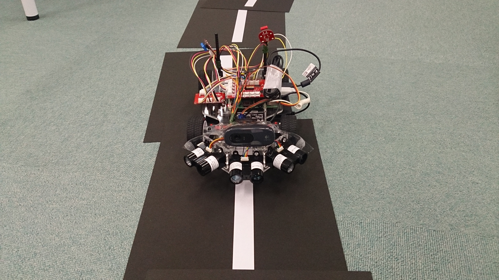

<a name='top'>

【タイトル】
# レベル2：ロボットカー走行デモ

【目標】
#### ラインを検出してロボットカーを自走させる

【画像】 
 
 
 

【動画】 
level2解析動画：[./document/demo1.mp4](./document/demo1.mp4) 
走行デモ動画：[./document/demo2.mp4](./document/demo2.mp4) 

【実行環境】
* Fabo TYPE1 ロボットカー
  * USB Webcam
  * Fabo #605 Motor Shield Raspberry Pi Rev 1.0.1
  * Fabo Robot Car #1202 Rev. 1.0.1
  * Tower Pro SG90
  * Raspberry Pi3
    * Jessie Lite
    * docker
      * Ubuntu
      * Python 2.7
      * OpenCV 2.4
      * FaBoPWM-PCA9685-Python
      * FaBoGPIO-PCAL6408-Python

<a name='0'>

【実行】
* [インストール方法](#a)
* [Raspberry Pi3での実行方法](#b)
* [Jetson TX2での実行方法](#c)

【目次】
* [トラブルシューティング](#2)
  * Webcamが起動しない
  * 走行中にハンドルが固まった
  * Raspberry Pi3が起動しない
* [ディレクトリとファイルについて](#3)

<a name='a'>

## インストール方法
インストール済みのロボットカー/Jetson TX2を用意しているので省略します。 

[<ページTOP>](#top)　[<目次>](#0)

<a name='b'>

## Raspberry Pi3での実行方法
#### 1. ロボットカーのRaspberry Pi3にログインします
USER:pi 
PASSWORD:raspberry 
> `ssh pi@192.168.xxx.xxx` 

#### 2. rootになってdockerコンテナIDを調べます
> `sudo su` 
> `docker ps -a` 
>> CONTAINER ID        IMAGE                      COMMAND                  CREATED             STATUS                     PORTS                                                                    NAMES 
>> 2133fa3ca362        naisy/fabo-jupyter-armhf   "/bin/bash -c 'jup..."   3 weeks ago         Up 2 minutes               0.0.0.0:6006->6006/tcp, 0.0.0.0:8091->8091/tcp, 0.0.0.0:8888->8888/tcp   hardcore_torvalds 

STATUSがUpになっているコンテナIDをメモします。

#### 3. dockerコンテナにログインします

> `docker exec -it 2133fa3ca362 /bin/bash` 

#### 4. ロボットカーのディレクトリに移動します
> `cd /notebooks/github/RobotCarAI/level2_demo/` 
> `ls` 
>> total 36 
>> 160689 4 ./   125775 4 README.md  160691 4 fabolib/  142518 8 run_car.py 
>> 123628 4 ../  160690 4 document/  160692 4 lib/      142519 4 start_button.py 

#### 5. ロボットカーを起動します
> `python start_button.py` 

#### 6. 走行開始するには、ロボットカーの青いボタンを押します

#### 7. 走行停止するには、ロボットカーの赤いボタンを押します
 
Ctrl + c でstart_button.pyを終了します

[<ページTOP>](#top)　[<目次>](#0)

<a name='c'>

## Jetson TX2での実行方法
Jetson TX2での実行方法は今後追加予定です。 

[<ページTOP>](#top)　[<目次>](#0)

<a name='2'>

## トラブルシューティング
#### Webcamが起動しない
>`IOError: Couldn't open video file or webcam. If you're trying to open a webcam, make sure you video_path is an integer!`

OpenCVの映像取得に失敗した場合にこのエラーが発生します。 
他にカメラを使っているプロセスがなければ、数秒おいて再実行で解決することが多いです。 
それでも解決しない場合は、カメラのUSBケーブルを抜き差ししてください。 
これは再実行時によく発生します。 

#### 走行中にハンドルが固まった
>`VIDIOC_DQBUF: No such device`

ロボットカーの赤いボタンを押して車両を停止してください。 
走行中に突然一方方向に進み続けてしまう場合は、Raspberry Pi3からの電力供給が遮断されてカメラが認識不能になったために発生します。 
カメラのUSBケーブルを抜き差ししてください。 
Faboシールドの電源をRaspberry Pi3から取得している時に、サーボの消費電力量が増えた瞬間に発生します。電力供給はすぐに復旧するので走行は続くのですが、カメラが認識不能になるため、制御不能に陥ります。 
頻繁に発生する時は、2口USBバッテリーを使うか、level2_demo_socketを試してみてください。 

#### Raspberry Pi3が起動しない
バッテリーの出力不足が原因として上げられます。 
2A以上のモバイルバッテリーを使ってください。 

[<ページTOP>](#top)　[<目次>](#0)

<a name='3'>

## ディレクトリとファイルについて
* ディレクトリについて
  * document/ ドキュメント関連
  * fabolib/ Fabo製基板関連
  * lib/ SPI,ライン検出ライブラリ
* ファイルについて
  * README.md このファイル
  * run_car.py 自動走行コード
  * start_button.py 開始ボタンコード

[<ページTOP>](#top)　[<目次>](#0)

