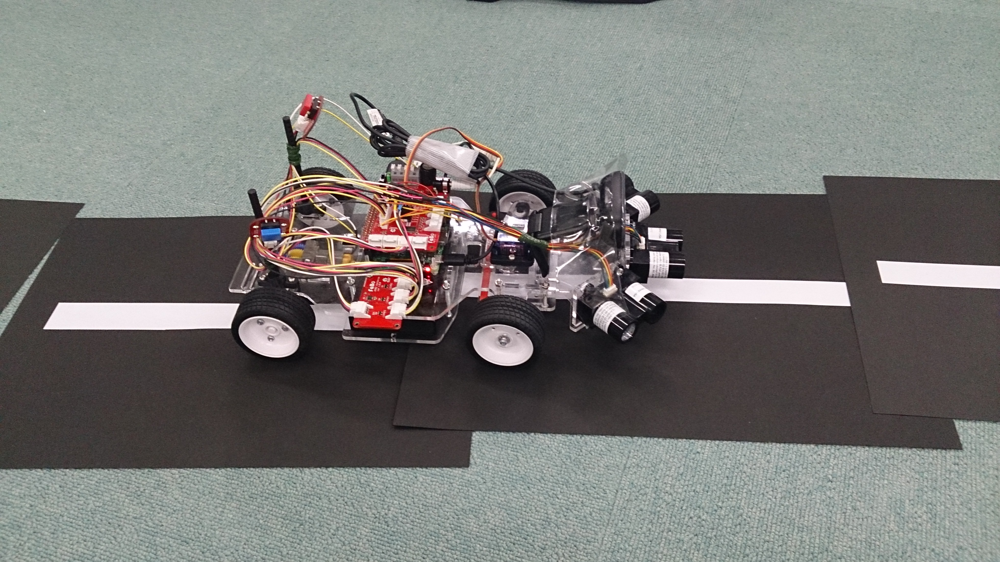
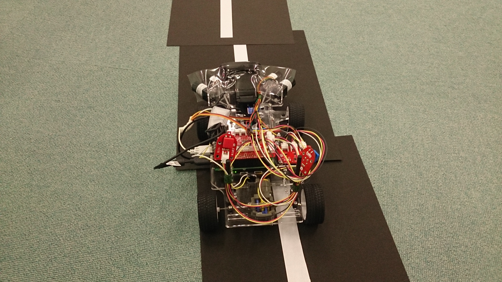

<a name='top'>

【タイトル】
# レベル2：ロボットカー走行デモ

【目標】
#### ラインを検出してロボットカーを自走させる

【画像】 
 
 
 
実行環境の構成
* Fabo TYPE1 ロボットカー

【動画】 
level2解析動画：[./document/demo1.mp4](./document/demo1.mp4) 
走行デモ動画：[./document/demo2.mp4](./document/demo2.mp4) 

<a name='0'>

【目次】
* [実行方法](#1)
* [ディレクトリとファイルについて](#2)

<a name='1'>

## 実行方法
> `python start_button.py` 

[<ページTOP>](#top)　[<目次>](#0)

<a name='2'>

## ディレクトリとファイルについて
* ディレクトリについて
  * document/ ドキュメント関連
  * fabolib/ Fabo製基板関連
  * lib/ SPI,ライン検出ライブラリ
* ファイルについて
  * README.md このファイル
  * run_car.py 自動走行コード
  * start_button.py 開始ボタンコード

[<ページTOP>](#top)　[<目次>](#0)

