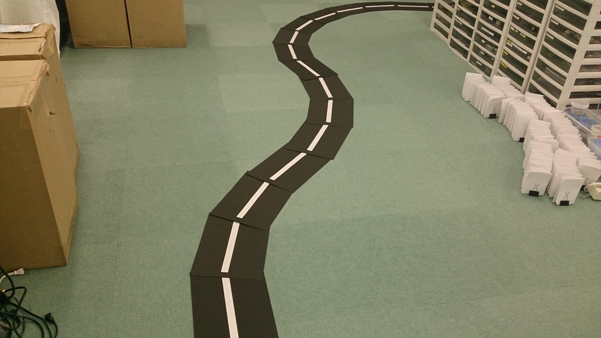

<a name='top'>

【タイトル】
# レベル2：ロボットカー走行デモ TCP通信版

【目標】
#### カメラ映像をTCP通信でサーバに送り、サーバからの走行指示でロボットカーを自走させる

【画像】 
 
 
 

【実行環境】
* Fabo TYPE1 ロボットカー
  * USB Webcam
  * Fabo #605 Motor Shield Raspberry Pi Rev 1.0.1
  * Fabo Robot Car #1202 Rev. 1.0.1
  * Tower Pro SG90
  * Raspberry Pi3
    * Jessie Lite
    * docker
      * Ubuntu
      * Python 2.7
      * OpenCV 2.4
      * FaBoPWM-PCA9685-Python
      * FaBoGPIO-PCAL6408-Python
* Jetson TX2
  * JetPack 3.1
    * Ubuntu
    * Python 3.6
    * OpenCV 3.3

<a name='0'>

【実行】
* [インストール方法](#a)
* [コースの準備](#course)
* [Jetson TX2/PC] [サーバ起動](#b)
* [Raspberry Pi3] [ロボットカー起動](#c)

【目次】
* [トラブルシューティング](#2)
  * Webcamが起動しない
  * 走行中にハンドルが固まった
  * Raspberry Pi3が起動しない
  * サーバが起動しない
* [ディレクトリとファイルについて](#3)

<a name='a'>

## インストール方法
インストール済みのロボットカー/Jetson TX2を用意しているので省略します。 

[<ページTOP>](#top)　[<目次>](#0)

<a name='course'>

## コースの準備
コースは白線で作り、カーブは緩やかに作ってください。 
カーブが急だとカメラに映らなくなります。 

 

[<ページTOP>](#top)　[<目次>](#0)

<a name='b'>

## [Jetson TX2/PC] サーバ起動
#### 1. Jetson TX2にログインします
USER:ubuntu 
PASSWORD:ubuntu 
> `ssh ubuntu@192.168.xxx.xxx` 

用意してあるJetson TX2はDockerを使っていないので、Raspberry Pi3の時のようなdockerコンテナへのログインはありません。 

#### 2. ロボットカーのディレクトリに移動します
> `cd ~/notebooks/github/RobotCarAI/level2_demo_socket/pc_server` 
> `ls` 
>> total 24 
>> 160938  4 ./  160847  4 ../  160939  4 lib/  142530 12 server.py 

#### 3. ソースコードのIPアドレスをサーバのIPアドレスに修正します
サーバ側が監視する自分のIPアドレスとTCPポート番号をサーバに合わせて修正してください。 
> `vi server.py` 
>>`    HOST = '192.168.0.77' # Server IP Address` 
>>`    PORT = 6666 # Server Port` 

#### 4. ライン検出コードを実行します
> `python server.py` 

[<ページTOP>](#top)　[<目次>](#0)

<a name='c'>

## [Raspberry Pi3] ロボットカー起動
#### 1. ロボットカーのRaspberry Pi3にログインします
USER:pi 
PASSWORD:raspberry 
> `ssh pi@192.168.xxx.xxx` 

#### 2. rootになってdockerコンテナIDを調べます
> `sudo su` 
> `docker ps -a` 
>> CONTAINER ID        IMAGE                      COMMAND                  CREATED             STATUS                     PORTS                                                                    NAMES 
>> 2133fa3ca362        naisy/fabo-jupyter-armhf   "/bin/bash -c 'jup..."   3 weeks ago         Up 2 minutes               0.0.0.0:6006->6006/tcp, 0.0.0.0:8091->8091/tcp, 0.0.0.0:8888->8888/tcp   hardcore_torvalds 

STATUSがUpになっているコンテナIDをメモします。

#### 3. dockerコンテナにログインします
docker exec -it CONTAINER_ID /bin/bash 
> `docker exec -it 2133fa3ca362 /bin/bash` 

CONTAINER_IDにはベースイメージがnaisy/fabo-jupyter-armhfの2133fa3ca362を使います。 

#### 4. ロボットカーのディレクトリに移動します
> `cd /notebooks/github/RobotCarAI/level2_demo_socket/car_client/` 
> `ls` 
>> total 28 
>> 160848 4 ./  160847 4 ../  160850 4 fabolib/  160937 4 lib/  142528 8 run_car_client.py  142529 4 start_button.py 

#### 5. ソースコードのIPアドレスをサーバのIPアドレスに修正します
クライアント側も通信先のサーバのIPアドレスとTCPポート番号をサーバに合わせて修正してください。 
> `vi run_car_client.py` 
>>`    HOST = '192.168.0.77' # Server IP Address` 
>>`    PORT = 6666 # Server Port` 

#### 5. ロボットカーを起動します
> `python start_button.py` 

#### 6. 走行開始するには、ロボットカーの青いボタンを押します

#### 7. 走行停止するには、ロボットカーの赤いボタンを押します
 
Ctrl + c でstart_button.pyを終了します

[<ページTOP>](#top)　[<目次>](#0)

<a name='2'>

## トラブルシューティング
#### Webcamが起動しない
>`IOError: Couldn't open video file or webcam. If you're trying to open a webcam, make sure you video_path is an integer!`

OpenCVの映像取得に失敗した場合にこのエラーが発生します。 
他にカメラを使っているプロセスがなければ、数秒おいて再実行で解決することが多いです。 
それでも解決しない場合は、カメラのUSBケーブルを抜き差ししてください。 
これは再実行時によく発生します。 

#### 走行中にハンドルが固まった
>`VIDIOC_DQBUF: No such device`

ロボットカーの赤いボタンを押して車両を停止してください。 
カメラのUSBケーブルを抜き差ししてください。 
走行中に突然一方方向に進み続けてしまう場合は、Raspberry Pi3からの電力供給が遮断されてカメラが認識不能になったために発生します。 
Faboシールドの電源をRaspberry Pi3から取得している時に、サーボの消費電力量が増えた瞬間に発生します。電力供給はすぐに復旧するので走行は続くのですが、カメラが認識不能になるため、制御不能に陥ります。 

#### Raspberry Pi3が起動しない
バッテリーの出力不足が原因として上げられます。 
2A以上のモバイルバッテリーを使ってください。 

#### サーバが起動しない
server.pyのHOST,PORTを確認してください。 
Dockerを使っている場合は、HOSTはDockerコンテナIDになります。 
ファイアーウォールは通常、内部IPに対して設定していないので通信可能ですが、設定している場合はサーバ側でTCPポート番号の通信を許可してください。 

#### 走行開始ボタンを押してもすぐ終了する
run_car.pyのHOST,PORTを確認してください。(サーバのIPアドレス、ポート番号を設定します) 
サーバが起動していることを確認してください。 

カメラエラーかもしれないので、USBカメラを抜き差ししてください。 

[<ページTOP>](#top)　[<目次>](#0)

<a name='3'>

## ディレクトリとファイルについて
* ディレクトリについて
  * car_client/ ロボットカー制御関連
  * car_client/fabolib/ Fabo製基板関連
  * car_client/lib/ SPI,カメラライブラリ
  * pc_server/ サーバ解析関連
  * pc_server/lib/ ライン検出関連
* ファイルについて
  * README.md このファイル
  * car_client/run_car_client.py 自動走行コード
  * car_client/start_button.py 開始ボタンコード
  * pc_server/server.py サーバ起動コード

[<ページTOP>](#top)　[<目次>](#0)

