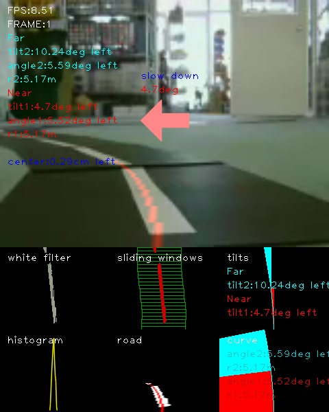

<a name='top'>

【タイトル】
# レベル2：OpenCVでラインを検出する

【目標】
#### 映像から、ラインを検出する

【画像】 
 

【動画】 
入力動画：[./demo_lane/input4.mp4](./demo_lane/input4.mp4) 
出力動画：[./document/result_input4.mp4](./document/result_input4.mp4) 

【参考】 
Programmatic lane finding: [https://github.com/BillZito/lane-detection](https://github.com/BillZito/lane-detection)
level4:OpenCVでレーン検出する: [level4_lane_detection](../level4_lane_detection)

【実行環境】
* Fabo TYPE1 ロボットカー
  * USB Webcam
  * Raspberry Pi3
    * Jessie Lite
    * docker
      * Ubuntu
      * Python 2.7
      * OpenCV 2.4
* Jetson TX2
  * USB Webcam
  * JetPack 3.1
    * Ubuntu
    * Python 3.6
    * OpenCV 3.3

<a name='0'>

【実行】
* [インストール方法](#a)
* [Raspberry Pi3での実行方法](#b)
* [Jetson TX2での実行方法](#c)

【目次】
* [実行方法](#1)
* [処理について](#2)
* [ディレクトリとファイルについて](#3)

<a name='a'>

## インストール方法
インストール済みのロボットカー/Jetson TX2を用意しているので省略します。 

[<ページTOP>](#top)　[<目次>](#0)

<a name='b'>

## Raspberry Pi3での実行方法
#### 1. ロボットカーのRaspberry Pi3にログインします
USER:pi 
PASSWORD:raspberry 
> `ssh pi@192.168.xxx.xxx` 

#### 2. rootになってdockerコンテナIDを調べます
> `sudo su` 
> `docker ps -a` 
>> CONTAINER ID        IMAGE                      COMMAND                  CREATED             STATUS                     PORTS                                                                    NAMES 
>> 2133fa3ca362        naisy/fabo-jupyter-armhf   "/bin/bash -c 'jup..."   3 weeks ago         Up 2 minutes               0.0.0.0:6006->6006/tcp, 0.0.0.0:8091->8091/tcp, 0.0.0.0:8888->8888/tcp   hardcore_torvalds 

STATUSがUpになっているコンテナIDをメモします。

#### 3. dockerコンテナにログインします

> `docker exec -it 2133fa3ca362 /bin/bash` 

#### 4. ロボットカーのディレクトリに移動します
> `cd /notebooks/github/RobotCarAI/level2_lane_detection/` 
> `ls` 
>> total 68 
>> 160846  4 ./         160940  4 demo_lane/  125612 24 opencv_lane_detection.py  142544  4 to_inverse_perspective_mapping.py 
>> 123628  4 ../        160941  4 document/   160851  4 output/                   142545  4 to_region_of_interest.py 
>> 142509  4 README.md  160849  4 lib/        160942  4 test_images/              142546  4 to_white.py 

#### 5. ライン検出コードを実行します
> `python opencv_lane_detection.py` 
>> FPS:6.43823125369  
>> frame 229 Done! 

途中、ライン検出に失敗したフレームでエラーを吐きながら進みますが実行には問題ありません。 
>Traceback (most recent call last): 
>  File "opencv_lane_detection.py", line 211, in main 
>    line_polyfit_const, pts_line = calc_line_curve(line_x,line_y,plot_y) 
>  File "/notebooks/github/RobotCarAI/level2_lane_detection/lib/functions.py", line 799, in calc_line_curve 
>    line_polyfit_const = polynormal_fit(line_y,line_x) 
>  File "/notebooks/github/RobotCarAI/level2_lane_detection/lib/functions.py", line 777, in polynormal_fit 
>    polyfit_const = np.polyfit(pts_y, pts_x, 2) 
>  File "/usr/local/lib/python2.7/dist-packages/numpy/lib/polynomial.py", line 555, in polyfit 
>    raise TypeError("expected non-empty vector for x") 
>TypeError: expected non-empty vector for x 

#### 6. 確認します
ブラウザでRaspberry Pi3のjupyterにアクセスします 
> http://192.168.xxx.xxx:8888/tree/github/RobotCarAI/level2_lane_detection/ 
jupyterのpasswordは別途説明があるかと思います。 

実行によってできたデータは、 
http://192.168.xxx.xxx:8888/tree/github/RobotCarAI/level2_lane_detection/output/result_capture.avi 
になります。 

この実行で使った入力用データは、 
http://192.168.xxx.xxx:8888/tree/github/RobotCarAI/level2_lane_detection/demo_lane/capture.mp4 
になります。 

[<ページTOP>](#top)　[<目次>](#0)

## Jetson TX2での実行方法
#### 1. Jetson TX2にログインします
USER:ubuntu 
PASSWORD:ubuntu 
> `ssh ubuntu@192.168.xxx.xxx` 

用意してあるJetson TX2はDockerを使っていないので、Raspberry Pi3の時のようなdockerコンテナへのログインはありません。 

#### 2. ロボットカーのディレクトリに移動します
> `cd ~/notebooks/github/RobotCarAI/level2_lane_detection/` 
> `ls` 
>> total 68 
>> 160846  4 ./         160940  4 demo_lane/  125612 24 opencv_lane_detection.py  142544  4 to_inverse_perspective_mapping.py 
>> 123628  4 ../        160941  4 document/   160851  4 output/                   142545  4 to_region_of_interest.py 
>> 142509  4 README.md  160849  4 lib/        160942  4 test_images/              142546  4 to_white.py 

#### 3. ライン検出コードを実行します
> `python opencv_lane_detection.py` 
>> FPS:34.37121576286537  
>> frame 229 Done! 

途中、ライン検出に失敗したフレームでエラーを吐きながら進みますが実行には問題ありません。 
>Traceback (most recent call last): 
>  File "opencv_lane_detection.py", line 211, in main 
>    line_polyfit_const, pts_line = calc_line_curve(line_x,line_y,plot_y) 
>  File "/home/ubuntu/notebooks/github/RobotCarAI/level2_lane_detection/lib/functions.py", line 799, in calc_line_curve 
>    line_polyfit_const = polynormal_fit(line_y,line_x) 
>  File "/home/ubuntu/notebooks/github/RobotCarAI/level2_lane_detection/lib/functions.py", line 777, in polynormal_fit 
>    polyfit_const = np.polyfit(pts_y, pts_x, 2) 
>  File "/usr/local/lib/python3.6/dist-packages/numpy/lib/polynomial.py", line 555, in polyfit 
>    raise TypeError("expected non-empty vector for x") 
>TypeError: expected non-empty vector for x 

#### 6. 確認します
ブラウザでRaspberry Pi3のjupyterにアクセスします 
> http://192.168.xxx.xxx:8888/tree/github/RobotCarAI/level2_lane_detection/ 
jupyterのpasswordは別途説明があるかと思います。 

実行によってできたデータは、 
http://192.168.xxx.xxx:8888/tree/github/RobotCarAI/level2_lane_detection/output/result_capture.avi 
になります。 

この実行で使った入力用データは、 
http://192.168.xxx.xxx:8888/tree/github/RobotCarAI/level2_lane_detection/demo_lane/capture.mp4 
になります。 

#### これ以降について
ライン検出は、level4(仮)の2本線から走行レーンを検出するコードを1本線に簡素化したものになります。 
処理内容についてはlevel4(仮)を参考にしてください。level4(仮)が分かれば、要らないものを削っていくだけのコード修正でできる内容になります。 

[<ページTOP>](#top)　[<目次>](#0)

<a name='1'>

## 実行方法
> `git pull https://github.com/FaBoPlatform/RobotCarAI` 
> `cd level2_lane_detection` 
> `python opencv_lane_detection.py` 

./demo_lane/capture.mp4を読み込み、白線で出来たラインを検出して車両に与えるためのハンドル角度を描画します。 
検出結果は./output/result_capture.aviに保存されます。

自分のライン動画で検出する場合、視点変更、ラインの色抽出を調整する必要があります。 
関心領域の確認 
> `python to_region_of_interest.py` 

視点の確認 
> `python to_inverse_perspective_mapping.py` 

白色抽出の確認 
> `python to_white.py` 

<a name='2'>

## 処理について
処理方法はlevel4:OpenCVでレーン検出する: [level4_lane_detection](../level4_lane_detection)と同じ流れになります。 
level4を1本線の処理に修正したものになるため、処理についてはlevel4を参考にしてください。 

[<ページTOP>](#top)　[<目次>](#0)

<a name='3'>
## [ディレクトリとファイルについて]
* ディレクトリについて
  * documment/ ドキュメント関連
  * demo_lane/ デモ用ディレクトリ
  * lib/ 関数ライブラリ
  * test_images/ ROI,IPM,白色フィルタの確認用ディレクトリ
  * output/ 出力用ディレクトリ(実行時に作成)
* ファイルについて
  * README.md このファイル
  * opencv_lane_detection.py ライン検出コード
  * to_region_of_interest.py ROI座標確認コード
  * to_inverse_perspective_mapping.py IPM座標確認コード
  * to_white.py 白色フィルタ確認コード
