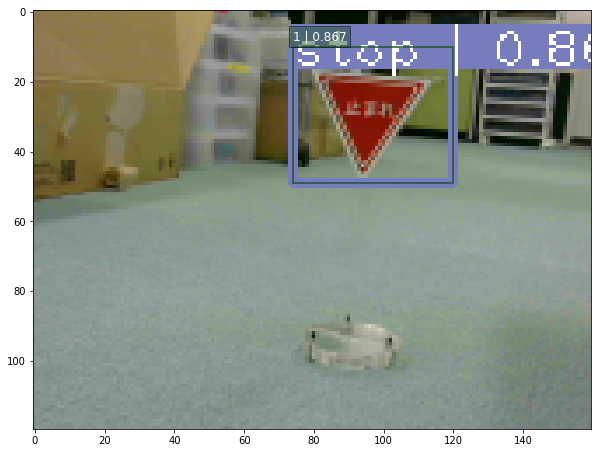

<a name='top'>

【タイトル】
# レベル3：ニューラルネットワークで道路標識を検出する
<hr>

【目標】
#### カメラ映像を取得し、道路標識を検出する

【画像】<br>
<br>
<br>

【動画】<br>
止まれを検出する動画：[./document/stop.mp4](./document/stop.mp4)<br>
走行しながら道路標識を検出する動画：[./document/course160x120.mp4](./document/course160x120.mp4)<br>

【実行環境】
* Fabo TYPE1 ロボットカー
  * USB Webcam
  * Raspberry Pi3
    * Jessie Lite
    * docker
      * Ubuntu
      * Python 2.7
      * OpenCV 2.4
      * Tensorflow r1.1.0
* Jetson TX2
  * USB Webcam
  * JetPack 3.1
    * Ubuntu
    * Python 3.6
    * OpenCV 3.3
    * Tensorflow r1.4.1

<hr>

<a name='0'>

【実行】
* [インストール方法](#a)
* [Raspberry Pi3での実行方法](#b)
* [Jetson TX2での実行方法](#c)

【目次】
* [物体検出の紹介](#1)
  * object detection
    * [OpenCV] [テンプレートマッチング]
    * [Python] [Selective Search]
    * [Neural Networks] [SSD: Single Shot MultiBox Detection]
    * [Python/TensorFlow] [TensorFlow Object Detection API]
* [Python/OpenCV/TensorFlow] [Balancap SSD-Tensorflowを使う](#2)
  * インストール
  * demo実行
  * 扱える学習データフォーマット
  * 学習データを作成する
  * 学習コードの作成と学習実行
  * 検出実行
  * カメラ映像の読み込み
  * ストリーミング配信
  * ストリーミング解析実行
  * 動画に保存
* [ディレクトリとファイルについて](#3)
* [開発/学習/実行環境について](#4)
<hr>


<a name='a'>

## インストール方法
インストール済みのロボットカー/Jetson TX2を用意しているので省略します。<br>

[<ページTOP>](#top)　[<目次>](#0)
<hr>

## Raspberry Pi3での実行方法
#### 1. ロボットカーのRaspberry Pi3にログインします
USER:pi<br>
PASSWORD:raspberry<br>
> `ssh pi@192.168.xxx.xxx`<br>

#### 2. rootになってdockerコンテナIDを調べます
> `sudo su`<br>
> `docker ps -a`<br>
>> CONTAINER ID        IMAGE                      COMMAND                  CREATED             STATUS                     PORTS                                                                    NAMES<br>
>> 2133fa3ca362        naisy/fabo-jupyter-armhf   "/bin/bash -c 'jup..."   3 weeks ago         Up 2 minutes               0.0.0.0:6006->6006/tcp, 0.0.0.0:8091->8091/tcp, 0.0.0.0:8888->8888/tcp   hardcore_torvalds<br>

STATUSがUpになっているコンテナIDをメモします。

#### 3. dockerコンテナにログインします

> `docker exec -it 2133fa3ca362 /bin/bash`<br>

#### 4. ロボットカーのディレクトリに移動します
> `cd /notebooks/github/RobotCarAI/level3_object_detection/`<br>
> `ls`<br>
>> total 56<br>
>> 160711  4 ./         160811  4 copy_to_SSD-Tensorflow/  160814  4 patch_to_SSD-Tensorflow/  160725  4 train_scripts/<br>
>> 123628  4 ../        160712  4 document/                160721  4 roadsign_data/<br>
>> 125879 20 README.md  160713  4 install_scripts/         141626  4 script_define.conf<br>

#### 5. スクリプト設定ファイルを編集します
dockerのディレクトリパスに合わせて編集します。<br>

> `vi script_define.conf`<br>
>> # 編集前<br>
>> GIT_DIR=/home/ubuntu/notebooks/github<br>
>> ... <br>
>> VOC_DATASET_DIR=/home/ubuntu/notebooks/github/RobotCarAI/level3_object_detection/roadsign_data/PascalVOC<br>
>> TF_DATASET_DIR=/home/ubuntu/notebooks/github/RobotCarAI/level3_object_detection/roadsign_data/tfrecords<br>
>> # 編集後<br>
>> GIT_DIR=/notebooks/github<br>
>> ... <br>
>> VOC_DATASET_DIR=/notebooks/github/RobotCarAI/level3_object_detection/roadsign_data/PascalVOC<br>
>> TF_DATASET_DIR=/notebooks/github/RobotCarAI/level3_object_detection/roadsign_data/tfrecords<br>

#### 6. インストールスクリプトに実行権限を付与して実行します
> `chmod 755 ./install_scripts/*.sh`<br>
> `./install_scripts/install.sh`<br>

すでに実行してある場合は、再実行すると以下のようになりますので、パッチを戻すか？という問いにはnで答えてください。<br>
>fatal: destination path 'SSD-Tensorflow' already exists and is not an empty directory.<br>
>Archive:  ssd_300_vgg.ckpt.zip<br>
>  inflating: ssd_300_vgg.ckpt.index  <br>
>patching file /notebooks/github/SSD-Tensorflow/preprocessing/ssd_vgg_preprocessing.py<br>
>Reversed (or previously applied) patch detected!  Assume -R? [n] n<br>
>Apply anyway? [n] n<br>
>Skipping patch.<br>
>1 out of 1 hunk ignored -- saving rejects to file /notebooks/github/SSD-Tensorflow/preprocessing/ssd_vgg_preprocessing.py.rej<br>
>patching file /notebooks/github/SSD-Tensorflow/nets/ssd_vgg_300.py<br>
>Reversed (or previously applied) patch detected!  Assume -R? [n] n<br>
>Apply anyway? [n] n<br>
>Skipping patch.<br>
>3 out of 3 hunks ignored -- saving rejects to file /notebooks/github/SSD-Tensorflow/nets/ssd_vgg_300.py.rej<br>

よくわからなくなったら、SSD-Tensorflowのディレクトリを削除してからインストールスクリプトを実行してください。<br>

> `rm -rf /notebooks/github/SSD-Tensorflow/`<br>
> `./install_scripts/install.sh`<br>

#### 6. トレーニングスクリプトに実行権限を付与して実行します
> `chmod 755 ./train_scripts/*.sh`<br>
> `./train_scripts/setup_mytrain.sh`<br>
>> total objects:891<br>
>> label:objects:images<br>
>> stop:149:142<br>
>> speed_10:202:185<br>
>> speed_20:356:349<br>
>> speed_30:184:184<br>

実際の学習は多くのGPUメモリを搭載したマシンが必要となるので、ここでは学習は行いません。<br>

#### 7. 道路標識の検出を実行する
> `cd /notebooks/github/SSD-Tensorflow`<br>
> `python run_ssd.py`<br>
>> time:116.36789203 clock:54.87105800<br>
>> time:15.70358896 clock:51.92819900<br>
>> time:14.47124100 clock:51.34533300<br>
>> time:14.39473701 clock:50.40863100<br>
>> time:17.08592391 clock:51.68568700<br>
>> time:14.97833300 clock:47.98345900<br>
>> time:12.63103414 clock:47.83602600<br>
>> time:12.64851999 clock:48.24852800<br>
>> time:12.63877583 clock:47.83689600<br>
>> time:12.62398911 clock:48.13235200<br>
>> time:12.84498405 clock:48.04971600<br>
>> time:12.57889819 clock:47.78148500<br>
>> time:12.74054813 clock:48.23995300<br>
>> end<br>


Raspberry Pi3は物体検出を行うには非常に非力なので、実行には少し時間がかかります。<br>

#### 8. 検出結果を確認します
ブラウザでRaspberry Pi3のjupyterにアクセスします<br>
> http://192.168.xxx.xxx:8888/tree/github/SSD-Tensorflow/demo_images/<br>

jupyterのpasswordは別途説明があるかと思います。<br>

result_*.jpg が検出結果の画像になります。<br>

入力に使ったデータは、result_の付いていない画像になります。<br>

[<ページTOP>](#top)　[<目次>](#0)
<hr>

## Jetson TX2での実行方法
#### 1. Jetson TX2にログインします
USER:ubuntu<br>
PASSWORD:ubuntu<br>
> `ssh ubuntu@192.168.xxx.xxx`<br>

用意してあるJetson TX2はDockerを使っていないので、Raspberry Pi3の時のようなdockerコンテナへのログインはありません。<br>

#### 2. ロボットカーのディレクトリに移動します
> `cd ~/notebooks/github/RobotCarAI/level3_object_detection/`<br>
> `ls`<br>
>> total 56<br>
>> 160711  4 ./         160811  4 copy_to_SSD-Tensorflow/  160814  4 patch_to_SSD-Tensorflow/  160725  4 train_scripts/<br>
>> 123628  4 ../        160712  4 document/                160721  4 roadsign_data/<br>
>> 125879 20 README.md  160713  4 install_scripts/         141626  4 script_define.conf<br>


#### 3. インストールスクリプトに実行権限を付与して実行します
スクリプト設定ファイルはJetson TX2の環境に合わせて用意してあるので編集の必要はないので、インストールスクリプトの実行を行ってください。<br>
> `chmod 755 ./install_scripts/*.sh`<br>
> `./install_scripts/install.sh`<br>

すでに実行してある場合は、再実行すると以下のようになりますので、パッチを戻すか？という問いにはnで答えてください。<br>
>fatal: destination path 'SSD-Tensorflow' already exists and is not an empty directory.<br>
>Archive:  ssd_300_vgg.ckpt.zip<br>
>patching file /home/ubuntu/notebooks/github/SSD-Tensorflow/preprocessing/ssd_vgg_preprocessing.py<br>
>Reversed (or previously applied) patch detected!  Assume -R? [n] n<br>
>Apply anyway? [n] n<br>
>Skipping patch.<br>
>1 out of 1 hunk ignored -- saving rejects to file /home/ubuntu/notebooks/github/SSD-Tensorflow/preprocessing/ssd_vgg_preprocessing.py.rej<br>
>patching file /home/ubuntu/notebooks/github/SSD-Tensorflow/nets/ssd_vgg_300.py<br>
>Reversed (or previously applied) patch detected!  Assume -R? [n] n<br>
>Apply anyway? [n] n<br>
>Skipping patch.<br>
>3 out of 3 hunks ignored -- saving rejects to file /home/ubuntu/notebooks/github/SSD-Tensorflow/nets/ssd_vgg_300.py.rej<br>

よくわからなくなったら、SSD-Tensorflowのディレクトリを削除してからインストールスクリプトを実行してください。<br>

> `rm -rf /home/ubuntu/notebooks/github/SSD-Tensorflow/`<br>
> `./install_scripts/install.sh`<br>

#### 4. トレーニングスクリプトに実行権限を付与して実行します
> `chmod 755 ./train_scripts/*.sh`<br>
> `./train_scripts/setup_mytrain.sh`<br>
>> total objects:891<br>
>> label:objects:images<br>
>> stop:149:142<br>
>> speed_10:202:185<br>
>> speed_20:356:349<br>
>> speed_30:184:184<br>

実際の学習は多くのGPUメモリを搭載したマシンが必要となるので、ここでは学習は行いません。<br>
Jetson TX2は8GBのGPUメモリがありますが、これでも学習には向きません。<br>
この学習は、AWS p3.2xlargeインスタンスで1日程度実行してあります。<br>

#### 5. 道路標識の検出を実行する
> `cd ~/notebooks/github/SSD-Tensorflow`<br>
> `python run_ssd.py`<br>
>>time:25.23302293 clock:23.77420100<br>
>>time:1.77238727 clock:1.49304700<br>
>>time:1.77872753 clock:1.42159600<br>
>>time:1.78329659 clock:1.58512700<br>
>>time:1.76960158 clock:1.57257700<br>
>>time:1.41074395 clock:1.13222900<br>
>>time:0.36464643 clock:0.34475100<br>
>>time:0.36422086 clock:0.34886500<br>
>>time:0.36535668 clock:0.35530400<br>
>>time:0.35956836 clock:0.34501500<br>
>>time:0.36577463 clock:0.35173300<br>
>>time:0.37001014 clock:0.35788600<br>
>>time:0.36742902 clock:0.35056400<br>
>>end<br>

Jetson TX2はRaspberry Pi3よりかなり実行速度が速いことが分かります。<br>

#### 8. 検出結果を確認します
ブラウザでJetson TX2のjupyterにアクセスします<br>
> http://192.168.xxx.xxx:8888/tree/github/SSD-Tensorflow/demo_images/<br>

jupyterのpasswordは別途説明があるかと思います。<br>

result_*.jpg が検出結果の画像になります。<br>

入力に使ったデータは、result_の付いていない画像になります。<br>

[<ページTOP>](#top)　[<目次>](#0)
<hr>

<a name='1'>

## 物体検出の紹介
画像ベースで識別する方法は大きくわけて3種類あります。<br>
<br>
Classificationは画像1枚で判断します。<br>
Object Detectionは画像の特定の領域で判断します。<br>
Segmentationは画像の1画素単位で判断します。<br>
Classificationの方が処理速度が速く、Segmentationになると処理速度が遅くなります。<br>

今回はSSD300を使ったObject Detectionで道路標識をの検出します。<br>

#### [OpenCV] テンプレートマッチング
昔からある方法としては、黒枠などのテンプレート画像を検索する方法があり、OpenCVで使う事が出来ます。<br>
検出には入力画像内にあるテンプレート同様の画像サイズが、用意したテンプレート画像サイズとほぼ一致している必要があるため、複数のサイズでテンプレートを用意します。<br>
黒枠を検出したら、その内部をCNNで画像識別して結果を得ます。
<hr>

#### [Python] Selective Search
候補領域を選出し、その内部をCNNで画像識別して結果を得ます。<br>
テンプレートの用意は不要ですが、候補領域はアルゴリズムで算出されるため、領域が出なければ識別にかけることは出来ません。<br>
1つの画像に候補領域が大量に出てくると識別回数が増えて遅くなります。<br>
<hr>

#### [Neural Networks] SSD: Single Shot MultiBox Detection
VGG16を内部に持ち、DeepLearningによる物体検出と識別を行います。<br>
TensorFlowでのコードが公開されていますので、今回はこれを使うことにします。
<hr>

#### [Python/TensorFlow] TensorFlow Object Detection API
TensorFlow公式で用意されている物体検出APIです。<br>
様々なモデルを使うことが出来ますが、バージョンアップに伴うトラブルもあるため、今後に期待します。

[<ページTOP>](#top)　[<目次>](#0)
<hr>

<a name='2'>

## [Python/OpenCV/TensorFlow] Balancap SSD-Tensorflowを使う
TensorFlowを使った物体検出として、Balancap SSD-Tensorflowを使って道路標識を学習し、Jetson TX2で実行してみます。
Balancap SSD-Tensorflow：[https://github.com/balancap/SSD-Tensorflow](https://github.com/balancap/SSD-Tensorflow)

#### インストール
インストール先や学習コード生成に必要な情報はスクリプト設定ファイルで用意しました。環境に合わせて修正してください。<br>
デフォルトでは/home/ubuntu/notebooks/github/...としてあります。<br>

スクリプト設定ファイル：[./script_define.conf](./script_define.conf)<br>
```bash
# Balancap SSD-Tensorflowのディレクトリ
GIT_DIR=/home/ubuntu/notebooks/github
SSD_TENSORFLOW_DIR=$GIT_DIR/SSD-Tensorflow

# データ名
MY_TRAIN=roadsign
# 学習データディレクトリ
VOC_DATASET_DIR=/home/ubuntu/notebooks/github/RobotCarAI/level3_object_detection/roadsign_data/PascalVOC
TF_DATASET_DIR=/home/ubuntu/notebooks/github/RobotCarAI/level3_object_detection/roadsign_data/tfrecords

# 道路標識の学習データで使うラベル
# LABELS[0]はbackground(その他)用に空けておく
# 学習データのラベルを増やす時はここにも追加する
LABELS[1]=stop
LABELS[2]=speed_10
LABELS[3]=speed_20
LABELS[4]=speed_30

# 新規VGG16 checkpoint
CHECKPOINT_PATH=$SSD_TENSORFLOW_DIR/checkpoints/vgg_16.ckpt
# 学習を再開するcheckpoint
LEARNED_CHECKPOINT_PATH=$SSD_TENSORFLOW_DIR/output/model.ckpt-7352
```
<hr>

Balancap SSD-Tensorflow インストールスクリプト：[./install_scripts/install.sh](./install_scripts/install.sh)<br>
> `chmod 755 ./install_scripts/*.sh`<br>
> `./install_scripts/install.sh`<br>

<hr>

#### demo実行
jupyterでSSD-Tensorflow/notebooks/ssd_notebook.ipynb を開いて実行します。
<hr>

#### 扱える学習データフォーマット
SSD-Tensorflowで扱うことの出来るデータフォーマットはPascalVOC形式になります。<br>
自前の学習データを用意する際は、PascalVOC形式で作成する必要があります。
<hr>

#### 学習データを作成する
学習データはGUIツールのLabelImgを使って作成します。<br>
LabelImg：[https://github.com/tzutalin/labelImg](https://github.com/tzutalin/labelImg)<br>
LabelImg インストールスクリプト：[./install_scripts/install_labelimg.sh](./install_scripts/install_labelimg.sh)<br>
> `./install_scripts/install_labelimg.sh`<br>


GUIツールなので画面のある開発環境で学習データを作成してください。<br>
labelImgで作成したラベルは画像ファイルと同じディレクトリに作成されます。<br>
Balancap SSD-Tensorflowでは、TF-Recordへのコンバート時は画像ファイルをJPEGImagesに、ラベルファイルをAnnotationsに分けておく必要があります。<br>

画像データ:[./roadsign_data/PascalVOC/JPEGImages/](./roadsign_data/PascalVOC/JPEGImages)<br>
ラベルデータ:[./roadsign_data/PascalVOC/Annotations/](./roadsign_data/PascalVOC/Annotations/)<br>

学習データを作ったら、学習用コードの作成、データの変換、学習、となります。<br>
<hr>

#### 学習コードの作成と実行
Balancap SSD-Tensorflowの学習コードは、元の学習コードをコピーしてスクリプトで修正して作成します。<br>
<hr>

スクリプト設定ファイルで以下を設定します。
* 学習データディレクトリ
* ラベル

スクリプト設定ファイル：[./script_define.conf](./script_define.conf)<br>
```bash
# 学習データディレクトリ
VOC_DATASET_DIR=/notebooks/github/RobotCarAI/level3_object_detection/roadsign_data/PascalVOC
TF_DATASET_DIR=/notebooks/github/RobotCarAI/level3_object_detection/roadsign_data/tfrecords

# 道路標識の学習データで使うラベル
# LABELS[0]はbackground(その他)用に空けておく
# 学習データのラベルを増やす時はここにも追加する
LABELS[1]=stop
LABELS[2]=speed_10
LABELS[3]=speed_20
LABELS[4]=speed_30
```
<hr>

スクリプトコードを作成し、PascalVOCデータをTF-Recordsに変換して学習を実行します。<br>
スクリプト作成コード：[./train_scripts/setup_mytrain.sh](./train_scripts/setup_mytrain.sh)<br>
データ変換コード：[./train_scripts/convert_PascalVOC_to_TF-Records.sh](./train_scripts/convert_PascalVOC_to_TF-Records.sh)<br>
学習実行コード：[./train_scripts/train_ssd.sh](./train_scripts/train_ssd.sh)<br>
> `chmod 755 ./train_scripts/*`<br>
> `./train_scripts/setup_mytrain.sh`<br>
> `./train_scripts/convert_PascalVOC_to_TF-Records.sh`<br>
> `./train_scripts/train_ssd.sh`<br>
> `./train_scripts/freeze_graph.sh`<br>

学習はGPUを搭載した学習環境でおこないます。<br>
一定時間毎にcheckpointが保存されるので、適当なところでCtrl_z; kill %%で学習を停止してください。<br>

途中のチェックポイントから学習を再開する際は、スクリプト設定ファイルのLEARNED_CHECKPOINT_PATHに再開するチェックポイントを指定して学習を再開します。<br>
スクリプト設定ファイル：[./script_define.conf](./script_define.conf)<br>
```bash
# 学習済みcheckpoint
LEARNED_CHECKPOINT_PATH=$SSD_TENSORFLOW_DIR/output/model.ckpt-7352
```
学習再開クリプト：[./train_scripts/train_ssd_continue.sh](./train_scripts/train_ssd_continue.sh)<br>
> `./train_scripts/train_ssd_continue.sh`<br>

<hr>

Balancap SSD-Tensorflowではjpegしか扱えないため、pngで画像を用意した場合は変換が必要になります。  

> `apt-get install imagemagick`<br>
> `# png to jpg`<br>
> `for i in *.png ; do convert "$i" "${i%.*}.jpg" ; done`<br>
> `# replace xml`<br>
> `find ./ -name "*.xml" | xargs sed -i 's/\.png/.jpg/g'`<br>

<hr>

#### 検出実行
pbファイルを読み込んで実行します。<br>

検出結果は層毎に出てくるため、SSDNetクラスを使って集計を行います。<br>
検出実行コード：[./copy_to_SSD-Tensorflow/run_ssd.py](./copy_to_SSD-Tensorflow/run_ssd.py)<br>
```python
        # 予測実行
        rclasses, rscores, rbboxes =  process_image(sess,cv_bgr)
```

検出実行コード：[./copy_to_SSD-Tensorflow/run_ssd.py](./copy_to_SSD-Tensorflow/run_ssd.py)
> `cd /notebooks/github/SSD-Tensorflow/`<br>
> `python run_ssd.py`<br>

Jetson TX2<br>
> time:19.86998034 clock:18.56985800
> time:1.03599119 clock:0.93754800
> time:1.04325247 clock:0.87934800
> time:1.03981328 clock:0.94516900
> time:1.04054499 clock:0.94298500
> time:0.78034067 clock:0.67906600
> time:0.78434491 clock:0.73667700
> time:0.78234601 clock:0.72538500
> time:0.78174305 clock:0.72879300
> time:0.78478503 clock:0.73397900
> time:0.78188086 clock:0.72555700
> time:0.78177857 clock:0.73014300
> time:0.78230286 clock:0.72738200
> end

Raspberry Pi3<br>
> time:120.14480400 clock:55.83521200
> time:16.20854115 clock:52.09492600
> time:14.21805596 clock:51.28959800
> time:15.57702303 clock:51.27450300
> time:15.50608397 clock:51.43209300
> time:13.86155987 clock:47.86049200
> time:12.60688901 clock:47.83934000
> time:12.60392714 clock:48.27811200
> time:12.68156099 clock:47.87609600
> time:12.59844589 clock:48.02762300
> time:12.67574501 clock:48.29297900
> time:12.60959601 clock:47.78995400
> time:12.69101310 clock:48.27239100
> end

最初の1回目はJITになっているのか遅いです。<br>
2回目以降はJetson TX2とRaspberry Pi3では物体検出の実行速度に15倍以上の差があります。<br>

/notebooks/github/SSD-Tensorflow/demo_images/以下に検出元画像と検出結果画像があります。

<hr>

#### カメラ映像の読み込み
画像の時と同じで、カメラ映像の時も1フレームを1画像として読み込みます。<br>

画像の読み込み<br>
検出実行コード：[./copy_to_SSD-Tensorflow/run_ssd.py](./copy_to_SSD-Tensorflow/run_ssd.py)<br>
```python
        cv_bgr = cv2.imread(DEMO_DIR+"/" + file_name)
```

カメラ映像の読み込み<br>
WebCamストリーミング解析コード：[./copy_to_SSD-Tensorflow/run_streaming.py](./copy_to_SSD-Tensorflow/run_streaming.py)
```python
    vid = cv2.VideoCapture(1) # WebCam Jetson TX2 /dev/video1
...
            retval, cv_bgr = vid.read()
```
Jetson TX2の場合は/dev/video1がUSBカメラデバイスなので、cv2.VideoCapture(1)となります。<br>
Raspberry Pi3やPCでは/dev/video0がUSBカメラデバイスなので、cv2.VideoCapture(0)となります。<br>

UDPストリーミングで動画が送られている場合は、vid = cv2.VideoCapture('udp://localhost:8090')のようにUDPポートを指定して受信します。<br>
USBカメラが未接続だったり、ストリーミングが開始されていない時は映像取得に失敗します。
<hr>

#### ストリーミング配信
##### FFMPEG UDP Streamingを使う場合
送信側コマンド(192.168.0.77は受信側アドレス)<br>
> `ffmpeg -thread_queue_size 1024 -r 30 -video_size 160x120 -input_format yuyv422 -i /dev/video0 -pix_fmt yuv422p -threads 4 -f mpegts udp://192.168.0.77:8090`<br>

受信側確認コマンド(動画プレイヤーが立ち上がるので、画面のあるPCで確認する場合になります)
> `ffplay udp://localhost:8090`<br>

ロボットカーのRaspberry Pi3では、level3_demo_streamingでFFMPEG用にdockerイメージを用意してありますので、それを使うことができます。<br>
サーバに合わせてIPアドレスを変更してください。<br>
> `sudo su`<br>

dockerコンテナを作成する<br>
> `docker run -itd --device=/dev/video0:/dev/video0 ffmpeg /bin/bash -c "ffmpeg -thread_queue_size 1024 -r 1 -video_size 160x120 -input_format yuyv422 -i /dev/video0 -pix_fmt yuv422p -threads 4 -f mpegts udp://192.168.0.77:8090"`<br>
>> 95cbdd5f98b6981259e6b29a7e11ea3c24c945e7157ec4725a2d8d8e3491c918<br>


AWSで受信する場合は、UDPポートで受信出来るようにするために、外部IPアドレスを持ち、セキュリティグループにUDPポート番号を設定必要があります。<br>
Jetson TX2で受信する場合は、内部IPアドレスとポート番号だけで受信出来ます。

<hr>

#### ストリーミング解析実行
ストリーミング時はUDPポートを読み込みに指定します。
WebCamストリーミング解析コード：[./copy_to_SSD-Tensorflow/run_streaming.py](./copy_to_SSD-Tensorflow/run_streaming.py)
```python
    vid = cv2.VideoCapture('udp://localhost:8090') # UDP Streaming
```
分類結果、スコア、物体の領域が得られるので、例えばそれを画像に描画して動画に保存することが出来ます。<br>
ロボットカーの場合は描画や動画への保存は不要ですが、停止を検出したら数秒止まる、速度を検出したら速度を変更する、等の処理を行うことになります。
<hr>

#### 動画に保存
予測結果を画像に描画して動画で保存します。ここでは結果を見たいだけなので、保存する動画のFPSは適当に処理性能くらいにしておきます。<br>
Jetson TX2はメモリが不足になりやすいため、OOM(Out Of Memory)等で落ちやすいです。<br>

Jetson TX2では、pbファイル化して検出に不要なオペレーションをそぎ落としてメモリ消費量を抑えることで、SSDの結果を動画に保存することが出来ます。<br>

WebCamストリーミング解析コード：[./copy_to_SSD-Tensorflow/run_streaming.py](./copy_to_SSD-Tensorflow/run_streaming.py)
```python
# FPSは処理速度を実際の見てから考慮する
#out = cv2.VideoWriter(DEMO_DIR+'/output.avi', int(fourcc), fps, (int(vidw), int(vidh)))
out = cv2.VideoWriter(DEMO_DIR+'/output.avi', int(fourcc), 2.1, (int(vidw), int(vidh)))
    ...
            # 予測実行
            rclasses, rscores, rbboxes = process_image(sess,cv_bgr)
            # 枠を描く
            write_bboxes(cv_bgr, rclasses, rscores, rbboxes)
            # avi動画に保存する
            out.write(cv_bgr)
```
動画はavi形式で/notebooks/github/SSD-Tensorflow/demo_images/output.aviに保存されます。

[<ページTOP>](#top)　[<目次>](#0)

<hr>

<a name='3'>

## [ディレクトリとファイルについて]
* ディレクトリについて
  * documment/ ドキュメント関連
  * install_scripts/ インストールスクリプト
  * copy_to_SSD-Tensorflow/ Balancap SSD-Tensorflowにコピーするファイル
  * roadsign_data/ 道路標識データ
  * train_scripts/ 学習関連スクリプト
* ファイルについて
  * README.md このファイル
  * scritp_define.conf ディレクトリパス等設定ファイル
  * install_scripts/install.sh インストールスクリプト
    * install_scripts/install_balancap_ssd-tensorflow.sh Balancap SSD-Tensorflow ダウンロードスクリプト
    * install_scripts/setup_bugfix.sh Balancap SSD-Tensorflow バグ修正スクリプト
    * install_scripts/copy_to.sh ファイルコピースクリプト
    * install_scripts/patch_to.sh ファイル修正スクリプト
  * install_scripts/install_labelimg.sh LabelImg インストールスクリプト
  * copy_to_SSD-Tensorflow/add_input_x.py 学習済みcheckpointに入力名を追加するコード
  * copy_to_SSD-Tensorflow/freeze_graph.py モデル凍結コード
  * copy_to_SSD-Tensorflow/run_ssd.py 検出実行コード
  * copy_to_SSD-Tensorflow/model/ssd_roadsign.pb 学習済みモデル
  * copy_to_SSD-Tensorflow/run_streaming.py Webcamストリーミング動画解析コード
  * train_scripts/setup_mytrain.sh 学習コード生成スクリプト
  * train_scripts/convert_PascalVOC_to_TF-Records.sh 学習データ変換スクリプト
  * train_scripts/train_ssd.sh 学習実行スクリプト
  * train_scripts/train_ssd_continue.sh 学習再開スクリプト
  * train_scripts/freeze_graph.sh モデル凍結スクリプト

[<ページTOP>](#top)　[<目次>](#0)

<hr>

<a name='4'>

## [開発/学習/実行環境について]
* 開発環境
  * ラベル作成はGUIツールを使うため、画面のある環境が必要です。
* 学習環境
  * 学習環境はGPUが使える環境が必要です。
* 実行環境
  * 実行環境はUSBカメラが使える環境が必要です。
  * クラウドで実行する場合は、PCかRaspberryPi3等にUSBカメラを付けてFFMPEGを使ってカメラ映像をクラウド実行環境にUDP Streaming配信する必要があります。
  * USBカメラの代わりに画像ファイル、動画ファイルの読み込みも可能です。その場合はOpenCVの公式ドキュメントを参考にしてください。

[<ページTOP>](#top)　[<目次>](#0)
