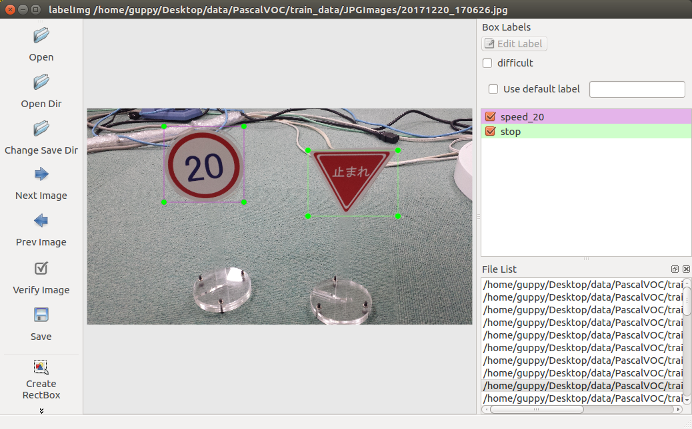

<a name='top'>

【タイトル】
# ニューラルネットワークで道路標識を検出する
<hr>

【目標】
#### カメラ映像を取得し、道路標識を検出する

【画像】
<br>

【動画】<br>
止まれを検出する動画：[./document/stop.avi](./document/stop.avi)<br>
走行しながら道路標識を検出する動画：[./document/course160x120.avi](./document/course160x120.avi)<br>

<hr>

<a name='0'>

【目次】
* [物体検出の紹介](#1)
  * [OpenCV] [テンプレートマッチング]
  * [Python] [Selective Search]
  * [Neural Networks] [SSD: Single Shot MultiBox Detection]
  * [Python/TensorFlow] [TensorFlow Object Detection API]
* [Python/OpenCV/TensorFlow] [Balancap SSD-Tensorflow](#2)
  * インストール
  * demo実行
  * 扱える学習データフォーマット
  * 学習データを作成する
  * 学習コードの作成と学習実行
  * カメラ映像の読み込み
  * 検出実行
  * 動画に保存
* [ディレクトリとファイルについて]
* [開発/学習/実行環境について]
<hr>

<a name='1'>

## 物体検出の紹介
物体検出はこれまでに色々な方法が試みられてきました。
#### [OpenCV] テンプレートマッチング
昔からある方法としては、黒枠などのテンプレート画像を検索する方法があり、OpenCVで使う事が出来ます。<br>
検出には入力画像内にあるテンプレート同様の画像サイズが、用意したテンプレート画像サイズとほぼ一致している必要があるため、複数のサイズでテンプレートを用意します。<br>
黒枠を検出したら、その内部をCNNで画像識別して結果を得ます。
<hr>

#### [Python] Selective Search
候補領域を選出し、その内部をCNNで画像識別して結果を得ます。<br>
テンプレートの用意は不要ですが、候補領域はアルゴリズムで算出されるため、領域が出なければ識別にかけることは出来ません。<br>
1つの画像に候補領域が大量に出てくると識別回数が増えて遅くなります。<br>
<hr>

#### [Neural Networks] SSD: Single Shot MultiBox Detection
VGG16を内部に持ち、DeepLearningによる物体検出と識別を行います。<br>
TensorFlowでのコードが公開されていますので、今回はこれを使うことにします。
<hr>

#### [Python/TensorFlow] TensorFlow Object Detection API
TensorFlow公式で用意されている物体検出APIです。<br>
様々なモデルを使うことが出来ますが、バージョンアップに伴うトラブルもあるため、今後に期待します。

[<ページTOP>](#top)　[<目次>](#0)
<hr>

<a name='2'>

## [Python/OpenCV/TensorFlow] Balancap SSD-Tensorflow
TensorFlowを使った物体検出として、Balancap SSD-Tensorflowを用いて道路標識を学習し、Jetson TX2で実行してみます。
Balancap SSD-Tensorflow：[https://github.com/balancap/SSD-Tensorflow](https://github.com/balancap/SSD-Tensorflow)

#### インストール
インストール先や学習コード生成に必要な情報はスクリプト設定ファイルで用意しました。環境に合わせて修正してください。<br>
/notebooks/github/以下にSSD-Tensorflowをgit cloneします。<br>
道路標識の学習データは/notebooks/roadsign_data/以下に置きます。<br>
スクリプト設定ファイル：[./script_define.conf](./script_define.conf)<br>
```bash
# Balancap SSD-Tensorflowのディレクトリ
GIT_DIR=/notebooks/github
SSD_TENSORFLOW_DIR=$GIT_DIR/SSD-Tensorflow

# データ名
MY_TRAIN=roadsign
# 学習データディレクトリ
VOC_DATASET_DIR=/notebooks/roadsign_data/PascalVOC
TF_DATASET_DIR=/notebooks/roadsign_data/tfrecords

# 道路標識の学習データで使うラベル
# LABELS[0]はbackground(その他)用に空けておく
# 学習データのラベルを増やす時はここにも追加する
LABELS[1]=stop
LABELS[2]=speed_10
LABELS[3]=speed_20
LABELS[4]=speed_30

# 新規VGG16 checkpoint
CHECKPOINT_PATH=$SSD_TENSORFLOW_DIR/checkpoints/vgg_16.ckpt
# 学習済みcheckpoint
LEARNED_CHECKPOINT_PATH=$SSD_TENSORFLOW_DIR/output/model.ckpt-4870
```
<hr>

Balancap SSD-Tensorflow インストールスクリプト：[./install_scripts/install_balancap_ssd-tensorflow.sh](./install_scripts/install_balancap_ssd-tensorflow.sh)<br>
バグ修正スクリプト：[./install_scripts/setup_bugfix.sh](./install_scripts/setup_bugfix.sh)<br>
> cd install_scripts/<br>
> chmod 755 *.sh<br>
> ./install_balancap_ssd-tensorflow.sh<br>
> ./setup_bugfix.sh<br>
<hr>

#### demo実行
jupyterでSSD-Tensorflow/notebooks/ssd_notebook.ipynb を開いて実行します。
<hr>

#### 扱える学習データフォーマット
SSD-Tensorflowで扱うことの出来るデータフォーマットはPascalVOC形式になります。<br>
自前の学習データを用意する際は、PascalVOC形式で作成する必要があります。
<hr>

#### 学習データを作成する
学習データはGUIツールのLabelImgを使って作成します。<br>
LabelImg：[https://github.com/tzutalin/labelImg](https://github.com/tzutalin/labelImg)<br>
LabelImg インストールスクリプト：[./install_scripts/install_labelimg.sh](./install_scripts/install_labelimg.sh)<br>
> cd install_scripts/<br>
> ./install_labelimg.sh<br>



GUIツールなので画面のある開発環境で学習データを作成してください。<br>
labelImgで作成したラベルは画像ファイルと同じディレクトリに作成されます。<br>
Balancap SSD-Tensorflowでは、TF-Recordへのコンバート時は画像ファイルをJPEGImagesに、ラベルファイルをAnnotationsに分けておく必要があります。<br>
画像データ:[./roadsign_data/PascalVOC/JPEGImages/](./roadsign_data/PascalVOC/JPEGImages)<br>
ラベルデータ:[./roadsign_data/PascalVOC/Annotations/](./roadsign_data/PascalVOC/Annotations/)<br>

学習データを作ったら、学習用コードの作成、データの変換、学習、となります。<br>
学習データとなるroadsign_dataのラベル作成が途中までしか進んでいないので、全ての画像のラベルを作成して学習すると認識率が向上するかもしれません。
<hr>

#### 学習コードの作成と実行
Balancap SSD-Tensorflowの学習コードは、元の学習コードをコピーしてスクリプトで修正して作成します。<br>
<hr>

スクリプト設定ファイルで以下を設定します。
* 学習データディレクトリ
* ラベル

スクリプト設定ファイル：[./script_define.conf](./script_define.conf)<br>
```bash
# 学習データディレクトリ
VOC_DATASET_DIR=/notebooks/roadsign_data/PascalVOC
TF_DATASET_DIR=/notebooks/roadsign_data/tfrecords

# 道路標識の学習データで使うラベル
# LABELS[0]はbackground(その他)用に空けておく
# 学習データのラベルを増やす時はここにも追加する
LABELS[1]=stop
LABELS[2]=speed_10
LABELS[3]=speed_20
LABELS[4]=speed_30
```
<hr>

スクリプトコードを作成し、PascalVOCデータをTF-Recordsに変換して学習を実行します。<br>
スクリプト作成コード：[./train_scripts/setup_mytrain.sh](./train_scripts/setup_mytrain.sh)<br>
データ変換コード：[./train_scripts/convert_PascalVOC_to_TF-Records.sh](./train_scripts/convert_PascalVOC_to_TF-Records.sh)
学習実行コード：[./train_scripts/train_ssh.sh](./train_scripts/train_ssh.sh)
> chmod 755 ./train_scripts/*<br>
> ./train_scripts/setup_mytrain.sh<br>
> ./train_scripts/convert_PascalVOC_to_TF-Records.sh<br>
> ./train_scripts/train_ssh.sh<br>

学習はGPUを搭載した学習環境でおこないます。<br>
一定時間毎にcheckpointが保存されるので、適当なところでCtrl_cで学習を停止してください。<br>

途中のチェックポイントから学習を再開する際は、スクリプト設定ファイルのLEARNED_CHECKPOINT_PATHに再開するチェックポイントを指定して学習を再開します。<br>
スクリプト設定ファイル：[./script_define.conf](./script_define.conf)<br>
```bash
# 学習済みcheckpoint
LEARNED_CHECKPOINT_PATH=$SSD_TENSORFLOW_DIR/output/model.ckpt-4870
```
学習再開クリプト：[./train_scripts/train_ssd_continue.sh](./train_scripts/train_ssd_continue.sh)<br>
>./train_scripts/train_ssd_continue.sh

<hr>

Balancap SSD-Tensorflowではjpegしか扱えないため、pngで画像を用意した場合は変換が必要になります。  

> apt-get install imagemagick<br>
> # png to jpg<br>
> `for i in *.png ; do convert "$i" "${i%.*}.jpg" ; done`<br>
> # replace xml<br>
> `find ./ -name "*.xml" | xargs sed -i 's/\.png/.jpg/g'`<br>

<hr>

#### カメラ映像の読み込み
カメラ映像はOpenCVを使って読み込みます。<br>
WebCamストリーミング解析コード：[./notebooks/ssd_webcam_streaming.py](./notebooks/ssd_webcam_streaming.py)
```python
    vid = cv2.VideoCapture(1) # WebCam Jetson TX2 /dev/video1
...
            retval, cv_bgr = vid.read()
```
このコードはSSD-Tensorflow/notebooks/ssd_webcam_streaming.pyにコピーして使います。<br>
USBカメラであれば、Jetson TX2の場合はcv2.VideoCapture(1)となります。<br>
UDPストリーミングで動画が送られている場合は、vid = cv2.VideoCapture('udp://localhost:8090')のようにUDPポートを指定して受信します。<br>
USBカメラが未接続だったり、ストリーミングが開始されていない時は映像取得に失敗します。
<hr>

##### FFMPEG UDP Streamingを使う場合。  
送信側コマンド(192.168.0.77は受信側アドレス)<br>
> `ffmpeg -thread_queue_size 1024 -r 30 -video_size 160x120 -input_format yuyv422 -i /dev/video0 -pix_fmt yuv422p -threads 4 -f mpegts udp://192.168.0.77:8090`<br>

受信側確認コマンド(受信を確認したらffplayを終了してください。)<br>
> ffplay udp://localhost:8090<br>

<hr>

#### 検出実行
物体検出の実行はOpenCVで読み込んだ画像データを検出実行関数に渡すだけになります。
WebCamストリーミング解析コード：[./notebooks/ssd_webcam_streaming.py](./notebooks/ssd_webcam_streaming.py)
```python
        # 予測実行
        rclasses, rscores, rbboxes =  process_image(cv_bgr)
```
分類結果、スコア、物体の領域が得られるので、例えばそれを画像に描画して動画に保存することが出来ます。
<hr>

#### 動画に保存
予測結果を画像に描画して動画で保存します。ここでは結果を見たいだけなので、保存する動画のFPSは適当に処理性能くらいにしておきます。<br>
WebCamストリーミング解析コード：[./notebooks/ssd_webcam_streaming.py](./notebooks/ssd_webcam_streaming.py)<br>
```python
# FPSは処理速度を実際の見てから考慮する
#out = cv2.VideoWriter('../output/output.avi', int(fourcc), fps, (int(vidw), int(vidh)))
out = cv2.VideoWriter('../output/output.avi', int(fourcc), 2.1, (int(vidw), int(vidh)))
    ...
        # 予測実行
        rclasses, rscores, rbboxes =  process_image(cv_bgr)
        # 枠を描く
        write_bboxes(cv_bgr, rclasses, rscores, rbboxes)
        # avi動画に保存する
        out.write(cv_bgr)
```

[<ページTOP>](#top)　[<目次>](#0)

<hr>


