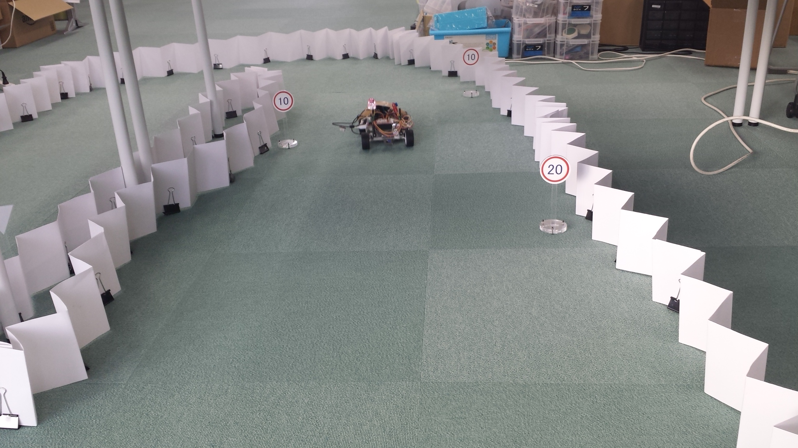

<a name='top'>

【タイトル】
# ニューラルネットワークで道路標識を検出する
<hr>

【目標】
#### カメラ映像を取得し、道路標識を検出する

【画像】
<br>

【動画】
止まれを検出する動画：[./document/stop.avi](./document/stop.avi)<br>
走行しながら道路標識を検出する動画：[./document/course160x120.avi](./document/course160x120.avi)<br>

<hr>

<a name='0'>

【目次】
* [物体検出の紹介](#1)
  * [OpenCV] [テンプレートマッチング]
  * [Python] [Selective Search]
  * [Neural Networks] [SSD: Single Shot MultiBox Detection]
  * [Python/TensorFlow] [TensorFlow Object Detection API]
* [Python/OpenCV/TensorFlow] [Balancap SSD-Tensorflow](#2)
  * インストール
  * とりあえず実行
  * バグ修正
  * 扱える学習データフォーマット
  * 学習データを作成する
  * 学習コードを作成する
  * 学習実行
  * カメラ映像の読み込み
  * 検出実行
  * 動画に保存
* [ディレクトリとファイルについて]
* [開発/学習/実行環境について]
<hr>

<a name='1'>

## 物体検出の紹介
物体検出はこれまでに色々な方法が試みられてきました。
#### [OpenCV] テンプレートマッチング
昔からある方法としては、黒枠などのテンプレート画像を検索する方法があり、OpenCVで使う事が出来ます。<br>
検出には入力画像内にあるテンプレート同様の画像サイズが、用意したテンプレート画像サイズとほぼ一致している必要があるため、複数のサイズでテンプレートを用意します。<br>
黒枠を検出したら、その内部をCNNで画像識別して結果を得ます。
<hr>

#### [Python] Selective Search
候補領域を選出し、その内部をCNNで画像識別して結果を得ます。<br>
テンプレートの用意は不要ですが、候補領域はアルゴリズムで算出されるため、領域が出なければ識別にかけることは出来ません。<br>
1つの画像に候補領域が大量に出てくると識別回数が増えて遅くなります。<br>
<hr>

#### [Neural Networks] SSD: Single Shot MultiBox Detection
VGG16を内部に持ち、DeepLearningによる物体検出と識別を行います。<br>
TensorFlowでのコードが公開されていますので、今回はこれを使うことにします。
<hr>

#### [Python/TensorFlow] TensorFlow Object Detection API
TensorFlow公式で用意されている物体検出APIです。<br>
様々なモデルを使うことが出来ますが、バージョンアップに伴うトラブルもあるため、今後に期待します。

[<ページTOP>](#top)　[<目次>](#0)
<hr>

<a name='2'>

## [Python/OpenCV/TensorFlow] Balancap SSD-Tensorflow
TensorFlowを使った物体検出として、Balancap SSD-Tensorflowを用いて道路標識を学習し、Jetson TX2で実行してみます。
Balancap SSD-Tensorflow：[https://github.com/balancap/SSD-Tensorflow](https://github.com/balancap/SSD-Tensorflow)

#### インストール
> cd install_scripts/<br>
> chmod 755 *.sh
> ./install_balancap_ssd-tensorflow.sh

git cloneでダウンロードしてcheckpointをunzipするだけなのですが、学習環境はjupyterがインストールされてあり、/notebooks/以下を使えるという前提でスクリプトを用意してあります。<br>

git clone https://github.com/balancap/SSD-Tensorflow


  * インストール
  * とりあえず実行
  * バグ修正
  * 扱える学習データフォーマット
  * 学習データを作成する
  * 学習コードを作成する
  * 学習実行
  * カメラ映像の読み込み
  * 検出実行
  * 動画に保存


[<ページTOP>](#top)　[<目次>](#0)
<hr>

<br>


##### 本ディレクトリをダウンロードしたら、shスクリプトに実行権限を与えます
```
chmod 755 install_scripts/*.sh
chmod 755 train_scripts/*.sh
```
##### shスクリプトにはインストール先のパスが設定されているので、環境に合わせて修正してください。

##### 道路標識の学習データとなるroadsign_dataをどこかに置きます。  
shスクリプトのパスに合わせて置き場所を決めてください。
```
mv roadsign_data /notebooks/
```

##### Balancap SSD-Tensorflowのgit cloneからバグ修正まで
```
./install_scripts/install_balancap_ssd-tensorflow.sh
./install_scripts/setup_bugfix.sh
```


##### 学習用コードの修正、データ変換
```
./train_scripts/setup_mytrain.sh
./train_scripts/convert_PascalVOC_to_TF-Records.sh
```

##### 学習
```
./train_scripts/train_ssd.sh
```
checkpointへの保存は一定時間毎に行われるようです。


##### 途中のチェックポイントから学習を再開する
```
./train_scripts/train_ssd_continue.sh
```

動作確認は
[https://github.com/balancap/SSD-Tensorflow/blob/master/notebooks/ssd_notebook.ipynb](https://github.com/balancap/SSD-Tensorflow/blob/master/notebooks/ssd_notebook.ipynb)
を参考に。

##### FFMPEG UDP Streamingを使う場合。  
送信側コマンド(192.168.0.77は受信側アドレス)
```
ffmpeg -thread_queue_size 1024 -r 30 -video_size 160x120 -input_format yuyv422 -i /dev/video0 -pix_fmt yuv422p -threads 4 -f mpegts udp://192.168.0.77:8090
```
受信側確認コマンド(受信を確認したらffplayを終了してください。)
```
ffplay udp://localhost:8090
```
##### Balancap SSD-Tensorflowを用いた判定を動画に保存する例。  
ssd_webcam_streaming.ipynbをコピーしてjupyterで開いて実行します。  
パスはgit cloneした場所に合わせて変更してください。
```
cp ./notebooks/ssd_webcam_streaming.ipynb /notebooks/github/SSD-Tensorflow/notebooks/
```


##### 学習データの作り方
Balancap SSD-TensorflowはPascal VOCデータ形式のみ対応なので、
[https://github.com/tzutalin/labelImg](https://github.com/tzutalin/labelImg)
を使って画像のラベルデータを作成します。
```
chmod 755 ./gui_labelimg/install_labelimg.sh
./gui_labelimg/install_labelimg.sh
```


GUIツールなので画面のあるマシンで学習データ作成を行ってください。  
TF-Recordへのコンバート時は画像ファイルをJPEGImagesに、ラベルファイルをAnnotationsに分けます。  
画像データ:/notebooks/roadsign_data/PascalVOC/JPEGImages/  
ラベルデータ:/notebooks/roadsign_data/PascalVOC/Annotations/  

学習データを作ったら、学習用コードの修正、データの変換を行ってから学習を行います。  
##### 自前のデータの場合は、各スクリプト上部にあるパスやラベル名を修正してください。  
学習用コードの修正、データ変換、学習
```
./train_scripts/setup_mytrain.sh
./train_scripts/convert_PascalVOC_to_TF-Records.sh
./train_scripts/train_ssh.sh
```

Balancap SSD-Tensorflowではjpegしか扱えないため、pngで画像を用意した場合は変換が必要になります。  
```
apt-get install imagemagick
# png to jpeg
for i in *.png ; do convert "$i" "${i%.*}.jpg" ; done
# replace xml
find ./ -name "*.xml" | xargs sed -i 's/\.png/.jpg/g'
```

学習データとなるroadsign_dataのラベル作成が途中までしか進んでいないので、全ての画像のラベルを作成して学習すると認識率が向上するかもしれません。