<a name='top'>

【タイトル】
# レベル4：OpenCVでレーンを検出する
<hr>

【目標】
#### カメラ映像を取得し、レーンを検出する

【画像】<br>
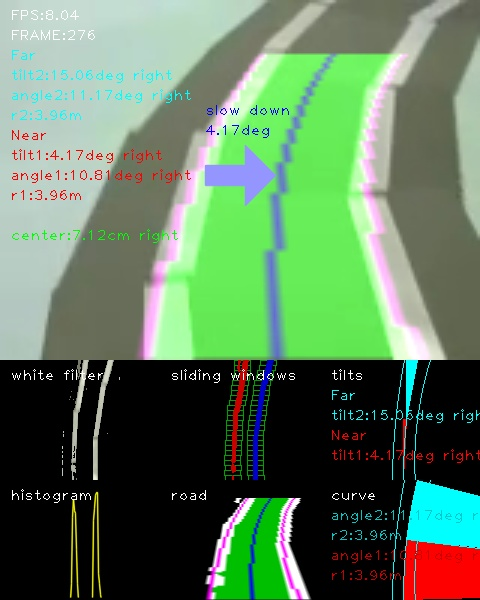<br>

【動画】<br>
入力動画：[./demo_lane/input1.mp4](./demo_lane/input1.mp4)<br>
出力動画：[./document/result_output1.mp4](./document/result_output1.mp4)<br>
[](https://www.youtube.com/watch?v=xAi_31IcyZ0)<br>

【参考】<br>
Programmatic lane finding: [https://github.com/BillZito/lane-detection](https://github.com/BillZito/lane-detection)
<hr>

<a name='0'>

【目次】
* [Python/OpenCV] [Region Of Interst](#1)
  * [Python/OpenCV] [座標を探す]
  * [Python/OpenCV] [処理]
  * 考察
* [Python/OpenCV] [Inverse Perspective Mapping](#2)
  * [Python/OpenCV] [座標を探す]
  * [Python/OpenCV] [処理]
  * [Python/OpenCV] [逆変換]
  * 考察
* [Python/OpenCV] [白色フィルタ](#3)
  * [Python/OpenCV] [処理]
  * 考察
* [Python/OpenCV] [2値化](#4)
  * [Python/OpenCV] [処理]
* [Python/OpenCV] [histogram](#5)
  * [Python/OpenCV] [処理]
* [Python/OpenCV] [Sliding Windows](#6)
* [Python/OpenCV] [ライン検出](#7)
* [Python/OpenCV] [弧の角度と傾き角](#8)
  * [Python/OpenCV] 円の中心座標の求め方
* [Python/OpenCV] [ピクセル座標と実座標](#9)
* [Python/OpenCV] [中央線までの距離](#10)
* [Python/OpenCV] [描画](#11)
* [ディレクトリとファイルについて](#12)
<hr>

<a name='1'>

## [Python/OpenCV] Region Of Interest
Region Of Interst(ROI)は、画像内で必要になる領域が含まれている部分を抽出します。<br>
次に行うInverse Perspective Mappingと同じ座標とするので、直線が映っている画像で範囲を考えます。<br>
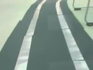
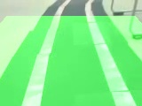
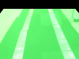
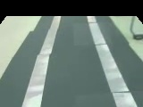<br>
<hr>

#### [Python/OpenCV] 座標を探す
座標は直線に沿って領域が見えるように探します。<br>
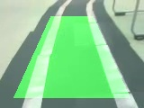

<br>
ソースコード：[./to_region_of_interest.py](./to_region_of_interest.py)<br>
```python
        # sample
        roi_vertices = calc_roi_vertices(cv_bgr,
                                         top_width_rate=0.3,top_height_position=0.15,
                                         bottom_width_rate=0.8,bottom_height_position=0.9)
```
次に示すのは極端な例ですが、ロボットカーのカメラ画像だと、範囲内に白線が入らないケースがあります。<br>


そこで、ここでは画面範囲よりも広く範囲を取るようにします。<br>


<br>
ソースコード：[./to_region_of_interest.py](./to_region_of_interest.py)<br>
```python
        # robocar camera demo_lane
        roi_vertices = calc_roi_vertices(cv_bgr,
                                         top_width_rate=0.9,top_height_position=0.15,
                                         bottom_width_rate=2.0,bottom_height_position=1)
```
<hr>

#### 処理
座標からポリゴン領域でマスク用イメージを作成し、入力画像からその範囲だけを抜き取ります。<br>
ソースコード：[./lib/functions.py](./lib/functions.py)<br>
```python
def to_roi(cv_bgr, vertices):
    """
    Region Of Interest
    頂点座標でmaskを作り、入力画像に適用する
    args:
        cv_bgr: OpenCV BGR画像データ
        vertices: 領域の頂点座標
    return:
        cv_bgr_result: 領域外を黒くしたOpenCV BGR画像データ
    """
    mask = np.zeros_like(cv_bgr)
    if len(mask.shape)==2:
        cv2.fillPoly(mask, vertices, 255)
    else:
        cv2.fillPoly(mask, vertices, (255,)*mask.shape[2]) # in case, the input image has a channel dimension
    return cv2.bitwise_and(cv_bgr, mask)
```

#### 考察
エッジ検出する際は、先にROIを使わない方がよい。マスクされた境界部分がエッジとして強く出てしまうため。<br>

[<ページTOP>](#top)　[<目次>](#0)
<hr>

<a name='2'>

## [Python/OpenCV] Inverse Perspective Mapping
Inverse Perspective Mapping(IPM)はBird's eye、TopView、鳥瞰図などと呼ばれる真上から見た画像に変換することが出来ます。<br>


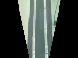<br>
<hr>

#### [Python/OpenCV] 座標を探す
IPMの座標は、道路の直線に沿うように座標を探します。<br>
ROIと同じ座標になりますが、変換をかけるため、ROIのmask用座標配列順とは異なる配列になります。<br>


<br>
ソースコード：[./to_inverse_perspective_mapping.py](./to_inverse_perspective_mapping.py)<br>
```python
        # robocar camera demo_lane
        ipm_vertices = calc_ipm_vertices(cv_bgr,
                                         top_width_rate=0.9,top_height_position=0.15,
                                         bottom_width_rate=2.0,bottom_height_position=1)
```
実際のコードではROIで処理を行ってからIPM処理を行っていますが、ROIの効果が限定的なため、ROIは無くてもいいかもしれません。
<hr>

#### [Python/OpenCV] 処理
ソース座標とディストネーション座標から変換行列を作成し、変換します。<br>
ソースコード：[./lib/functions.py](./lib/functions.py)<br>
```python
def to_ipm(cv_bgr,ipm_vertices):
    '''
    Inverse Perspective Mapping
    TopViewに画像を変換する
    args:
        cv_bgr: OpenCV BGR画像データ
        ipm_vertices: 視点変換座標
    return:
        cv_bgr_ipm: 変換後のOpenCV BGR画像データ
    '''
    rows, cols = cv_bgr.shape[:2]

    offset = cols*.25

    src = ipm_vertices
    dst = np.float32([[offset, 0], [cols - offset, 0], [cols - offset, rows], [offset, rows]])

    # srcとdst座標に基づいて変換行列を作成する
    matrix = cv2.getPerspectiveTransform(src, dst)

    # 変換行列から画像をTopViewに変換する
    cv_bgr_ipm = cv2.warpPerspective(cv_bgr, matrix, (cols, rows))

    return cv_bgr_ipm
```
<hr>

#### [Python/OpenCV] 逆変換
IPMはソース座標とディストネーション座標を逆にすることで、元の座標系に戻すことが可能です。<br>
ソースコード：[./lib/functions.py](./lib/functions.py)<br>
```python
def reverse_ipm(cv_bgr,ipm_vertices):
    '''
    IPM逆変換を行う
    args:
        cv_bgr: OpenCV BGR画像データ
        ipm_vertices: 変換時に使ったIPM座標
    return:
        cv_bgr_ipm_reverse: OpenCV BGR画像データ
    '''
    rows, cols = cv_bgr.shape[:2]

    offset = cols*.25

    dst = ipm_vertices
    src = np.float32([[offset, 0], [cols - offset, 0], [cols - offset, rows], [offset, rows]])

    matrix = cv2.getPerspectiveTransform(src, dst)

    cv_bgr_ipm_reverse = cv2.warpPerspective(cv_bgr, matrix, (cols,rows))
    return cv_bgr_ipm_reverse
```
IPM変換時に範囲外となった画像データは残っていませんので黒くなります。<br>

<hr>

#### 考察
ROIは使わないこともありますが、IPMは必須となる処理です。<br>
この変換により、直線の割り出しが簡単になります。<br>

[<ページTOP>](#top)　[<目次>](#0)
<hr>

<a name='3'>

## [Python/OpenCV] 白色フィルタ
画像から白線となる白色ピクセルを抜き出します。<br>
ここが最難関の部分で、白色フィルタの善し悪しでレーン検出の善し悪しが決まります。<br>
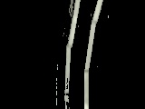<br>

<hr>

#### [Python/OpenCV] 処理
フィルタ範囲が狭いと白線を十分に検出出来ません。そこでフィルタ範囲を広げると今度はカーペットの色まで拾ってしまうので、これも失敗に繋がります。<br>
ソースコード：[./lib/functions.py](./lib/functions.py)<br>
```python
def to_white(cv_bgr):
    '''
    白色だけを抽出する
    args:
        cv_bgr: OpenCV BGR画像データ
    return:
        cv_bgr_result: OpenCV BGR画像データ
    '''
    print("to_white()")
    t0 = time.time()
    cv_hsv = cv2.cvtColor(cv_bgr, cv2.COLOR_BGR2HSV)
    # 取得する色の範囲を指定する
    lower1_color = np.array([0,0,120])
    upper1_color = np.array([45,40,255])
    lower2_color = np.array([50,0,200])
    upper2_color = np.array([100,20,255])
    lower3_color = np.array([45,0,225])
    upper3_color = np.array([100,40,255])
    lower4_color = np.array([50,0,180])
    upper4_color = np.array([75,25,200])

    # 指定した色に基づいたマスク画像の生成
    white1_mask = cv2.inRange(cv_hsv,lower1_color,upper1_color)
    white2_mask = cv2.inRange(cv_hsv,lower2_color,upper2_color)
    white3_mask = cv2.inRange(cv_hsv,lower3_color,upper3_color)
    white4_mask = cv2.inRange(cv_hsv,lower4_color,upper4_color)
    img_mask = cv2.bitwise_or(white1_mask, white2_mask)
    img_mask = cv2.bitwise_or(img_mask, white3_mask)
    img_mask = cv2.bitwise_or(img_mask, white4_mask)
    # フレーム画像とマスク画像の共通の領域を抽出する
    cv_bgr_result = cv2.bitwise_and(cv_bgr,cv_bgr,mask=img_mask)
    t1 = time.time()
    dt_cv = t1-t0
    print("Conversion took {:.5} seconds".format(dt_cv))

    return cv_bgr_result
```
<hr>

#### 考察
出来ればここにCycle GAN[(https://github.com/XHUJOY/CycleGAN-tensorflow)](https://github.com/XHUJOY/CycleGAN-tensorflow)のようなDeepLearningを用いて白線を綺麗に補完したものを用いたいところですが、今回は通常の白色フィルタを使って白色ピクセルを抜き出します。

[<ページTOP>](#top)　[<目次>](#0)
<hr>

<a name='4'>

## 2値化
白色フィルタで白色っぽいピクセルだけを取り出したので、それを2値化します。<br>
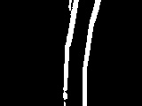<br>

#### 処理
2値化する際はガウスぼかしをセットで実施して境界線の弱い部分を消しておきます。<br>
カーペット部分を少しでも消したいため、グレースケール化した際に薄く残っている部分を削除しています。<br>

ソースコード：[./lib/functions.py](./lib/functions.py)<br>
```python
def to_bin(cv_bgr):
    '''
    画像を2値化する
    args:
        cv_bgr: OpenCV BGR画像データ
    return:
        cv_bin: OpenCV 2値化したグレースケール画像データ
    '''
    print("to_bin()")
    t0 = time.time()
    # ガウスぼかしで境界線の弱い部分を消す
    cv_gauss = cv2.GaussianBlur(cv_bgr,(5,5),0) # サイズは奇数
    cv_gray = cv2.cvtColor(cv_gauss, cv2.COLOR_BGR2GRAY)
    #plt.title('gray')
    #plt.imshow(cv_gray)
    #plt.show()

    # 色の薄い部分を削除する
    ret, mask = cv2.threshold(cv_gray, 20, 255, cv2.THRESH_BINARY)
    mask = cv2.bitwise_and(cv_gray,cv_gray,mask=mask)
    cv_gray = cv2.bitwise_and(cv_gray,cv_gray,mask=mask)
    #plt.title('gray')
    #plt.imshow(cv_gray)
    #plt.show()

    # 入力画像，閾値，maxVal，閾値処理手法
    ret,cv_bin = cv2.threshold(cv_gray,0,255,cv2.THRESH_BINARY|cv2.THRESH_OTSU);

    t1 = time.time()
    dt_cv = t1-t0
    print("Conversion took {:.5} seconds".format(dt_cv))
    return cv_bin
```
[<ページTOP>](#top)　[<目次>](#0)
<hr>

<a name='5'>

## [Python/OpenCV] histogram
sliding windowを始めるにあたって、最初のwindowの開始x座標を決める必要があります。<br>
そこで、2値化した画像下半分の各x座標上にあるピクセル数をカウントしたものをhistogramとします。<br>
sliding windowはhistogramの左右それぞれの最大値となるx座標から開始することにします。<br>

ソースコード：[./lib/functions.py](./lib/functions.py)<br>
```python
    # 画面下半分のピクセル数をカウントする
    histogram = np.sum(cv_bin[int(rows/2):,:], axis=0)
```
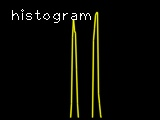<br>

[<ページTOP>](#top)　[<目次>](#0)

<hr>

<a name='6'>

## [Python/OpenCV] Sliding Windows
sliding windowsは左右のライン候補となるピクセル座標を求めるために、適当なサイズの枠をY軸方向にスライドしながら探していきます。<br>
開始位置のY座標は画像下から、X座標はhistogramの左右それぞれの最大値となるx座標から開始することにします。<br>
ウインドウの幅や高さは、白線の幅、カーブへの追従具合、ノイズの拾いやすさとのバランスで決めることになります。<br>
ソースコード：[./lib/functions.py](./lib/functions.py)<br>
```python
def sliding_windows(cv_bin):
    '''
    sliding windowを行い、左右レーンを構成するピクセル座標を求める
    args:
        cv_bin: 2値化したレーン画像のOpenCV grayscale画像データ
    returns:
        cv_rgb_sliding_windows: sliding window処理のOpenCV RGB画像データ
        histogram: 入力画像の下半分の列毎のピクセル総数の配列(1,col)
        left_x: 左レーンを構成するピクセルのx座標群
        left_y: 左レーンを構成するピクセルのy座標群
        right_x: 右レーンを構成するピクセルのx座標群
        right_y: 右レーンを構成するピクセルのy座標群
    '''
```
<br>

[<ページTOP>](#top)　[<目次>](#0)

<hr>

<a name='7'>

## [Python/OpenCV] ライン検出
sliding windowsによって左右白線のピクセル座標を得たら、それぞれにpolynormal fitを適用して二次多項式の定数を求めます。<br>
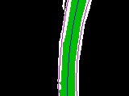<br>

ソースコード：[./lib/functions.py](./lib/functions.py)<br>
```python
def polynormal_fit(pts_y,pts_x):
    '''
    曲線を構成する点から二次多項式を求める
    (y軸の値は均等に取るのでxを求める式となる)
    args:
        pts_x: x座標配列
        pts_y: y座標配列
    returns:
        polyfit_const: 二次曲線x=ay**2+by+cの[a,b,c]の値
    '''
    polyfit_const = np.polyfit(pts_y, pts_x, 2)
    return polyfit_const
```
左右二次多項式の定数から中央線の二次多項式の定数を求めます。<br>
ソースコード：[./opencv_lane_detection.py](./opencv_lane_detection.py)<br>
```python
                # 左右センターの二次多項式と座標を求める
                left_polyfit_const, right_polyfit_const, center_polyfit_const, \
                    pts_left, pts_right, pts_center = calc_lr_curve_lane(left_x,left_y,right_x,right_y,plot_y)
```
ソースコード：[./lib/functions.py](./lib/functions.py)<br>
```python
def calc_lr_curve_lane(left_x,left_y,right_x,right_y,plot_y):
...
    # 左右の二次多項式を求める
    left_polyfit_const = polynormal_fit(left_y,left_x)
    right_polyfit_const = polynormal_fit(right_y,right_x)
    # センターの二次多項式を求める
    center_polyfit_const = [(left_polyfit_const[0]+right_polyfit_const[0])/2,(left_polyfit_const[1]+right_polyfit_const[1])/2,(left_polyfit_const[2]+right_polyfit_const[2])/2]
```
Y軸に等間隔な座標を生成し、左右中央の曲線上の座標を求めます。<br>
ソースコード：[./opencv_lane_detection.py](./opencv_lane_detection.py)<br>
```python
            # 等間隔なy座標を生成する
            plot_y = np.linspace(0, rows-1, rows)
```
ソースコード：[./lib/functions.py](./lib/functions.py)<br>
```python
def calc_lr_curve_lane(left_x,left_y,right_x,right_y,plot_y):
...
    # y軸に対する左右の二次多項式上のx座標を求める
    left_plot_x = left_polyfit_const[0]*plot_y**2 + left_polyfit_const[1]*plot_y + left_polyfit_const[2]
    right_plot_x = right_polyfit_const[0]*plot_y**2 + right_polyfit_const[1]*plot_y + right_polyfit_const[2]
    # y軸に対するセンターの二次多項式上のx座標を求める
    center_plot_x = center_polyfit_const[0]*plot_y**2 + center_polyfit_const[1]*plot_y + center_polyfit_const[2]

    '''
    x,y座標を[x,y]配列に変換する
    左右間の領域描画用に、右側座標は逆順にする
    pts_centerは中間線上の座標
    '''
    pts_left = np.int32(np.array([np.transpose(np.vstack([left_plot_x, plot_y]))]))
    pts_right = np.int32(np.array([np.flipud(np.transpose(np.vstack([right_plot_x, plot_y])))]))
    pts_center = np.int32(np.array([np.transpose(np.vstack([center_plot_x, plot_y]))]))

    return left_polyfit_const, right_polyfit_const, center_polyfit_const, pts_left, pts_right, pts_center
```
[<ページTOP>](#top)　[<目次>](#0)

<hr>

<a name='8'>

## [Python/OpenCV] 弧の角度と傾き角
画像内の道路は手前が直線、奥がカーブのようなケースがあるため、画面を上下2分割して角度を考えます。<br>
弧の角度はカーブの急さを表し、奥のカーブが急な時、減速する判断に用いることが出来ます。<br>
傾き角度は垂直方向と中央線の傾き角度を表し、手前のtilt1が中央線との現在の角度差になります。<br>
手前の傾き角度となるtilt1の値と、奥のカーブ角度となるangle2の値が重要になります。<br>
ソースコード：[./lib/functions.py](./lib/functions.py)<br>
```python
def calc_curve(curve_y0,curve_y1,curve_polyfit_const):
    '''
    曲線を計算する
    args:
        curve_y0: 曲線上y座標
        curve_y1: 曲線下y座標
        curve_ployfit_const: 曲線の定数
    returns:
        x: 円の中心x座標
        y: 円の中心y座標
        r: 円の半径r (曲率半径r)
        rotate_deg: 弧の回転角度
        angle_deg: 弧の描画角度
        curve_tilt_deg: y軸との傾き角度
    '''
    # 中間点における曲率半径Rを求める
    curve_y = curve_y1-curve_y0
    curve_r = calc_curvature_radius(curve_polyfit_const,curve_y)

    # x座標を求める
    curve_x0 = curve_polyfit_const[0]*curve_y0**2 + curve_polyfit_const[1]*curve_y0 + curve_polyfit_const[2]
    curve_x1 = curve_polyfit_const[0]*curve_y1**2 + curve_polyfit_const[1]*curve_y1 + curve_polyfit_const[2]

    # 2点と半径と曲線の定数から円の中心座標を求める
    py = curve_y1
    px = curve_x1
    qy = curve_y0
    qx = curve_x0
    r = curve_r
    x,y = calc_circle_center_point(px,py,qx,qy,r,curve_polyfit_const[0])

    # 弧の描画角度を求める
    rotate_deg, angle_deg = calc_ellipse_angle(py,px,qy,qx,r,x,y,curve_polyfit_const[0])
    print("py={},px={},qy={},qx={},x={},y={},r={}".format(py,px,qy,qx,x,y,r))
    print("rotate_deg={} angle_deg={}".format(rotate_deg,angle_deg))

    # 垂直方向との傾き角を求める
    # プラスなら左カーブ、マイナスなら右カーブ
    curve_tilt_rad = math.atan((px-qx)/(py-qy))
    curve_tilt_deg = math.degrees(curve_tilt_rad)
    print("curve_tilt_deg={}".format(curve_tilt_deg))

    return x,y,r,rotate_deg,angle_deg,curve_tilt_deg
```
<br>
<br>

#### 円の中心座標の求め方
ソースコード：[./lib/functions.py](./lib/functions.py)<br>
```python
def calc_circle_center_point(px,py,qx,qy,r,const):
    '''
    2点と半径rから円の中心座標を求める
    args:
        py: 円上の点Pのy座標
        px: 円上の点Pのx座標
        qy: 円上の点Qのy座標
        qx: 円上の点Qのx座標
        r: 円の半径r
        const: 候補2点の識別子
    return:
        x: 円の中心点x座標
        y: 円の中心点y座標
    '''
    if const > 0:
        x=((py - qy)*(np.sqrt(-(px**2 - 2*px*qx + py**2 - 2*py*qy + qx**2 + qy**2)*(px**2 - 2*px*qx + py**2 - 2*py*qy + qx**2 + qy**2 - 4*r**2))*(px - qx) - (py + qy)*(px**2 - 2*px*qx + py**2 - 2*py*qy + qx**2 + qy**2)) + (px**2 + py**2 - qx**2 - qy**2)*(px**2 - 2*px*qx + py**2 - 2*py*qy + qx**2 + qy**2))/(2*(px - qx)*(px**2 - 2*px*qx + py**2 - 2*py*qy + qx**2 + qy**2))
        y=(np.sqrt(-(px**2 - 2*px*qx + py**2 - 2*py*qy + qx**2 + qy**2)*(px**2 - 2*px*qx + py**2 - 2*py*qy + qx**2 + qy**2 - 4*r**2))*(-px + qx)/2 + (py + qy)*(px**2 - 2*px*qx + py**2 - 2*py*qy + qx**2 + qy**2)/2)/(px**2 - 2*px*qx + py**2 - 2*py*qy + qx**2 + qy**2)
    else:
        x=(-(py - qy)*(np.sqrt(-(px**2 - 2*px*qx + py**2 - 2*py*qy + qx**2 + qy**2)*(px**2 - 2*px*qx + py**2 - 2*py*qy + qx**2 + qy**2 - 4*r**2))*(px - qx) + (py + qy)*(px**2 - 2*px*qx + py**2 - 2*py*qy + qx**2 + qy**2)) + (px**2 + py**2 - qx**2 - qy**2)*(px**2 - 2*px*qx + py**2 - 2*py*qy + qx**2 + qy**2))/(2*(px - qx)*(px**2 - 2*px*qx + py**2 - 2*py*qy + qx**2 + qy**2))
        y=(np.sqrt(-(px**2 - 2*px*qx + py**2 - 2*py*qy + qx**2 + qy**2)*(px**2 - 2*px*qx + py**2 - 2*py*qy + qx**2 + qy**2 - 4*r**2))*(px - qx)/2 + (py + qy)*(px**2 - 2*px*qx + py**2 - 2*py*qy + qx**2 + qy**2)/2)/(px**2 - 2*px*qx + py**2 - 2*py*qy + qx**2 + qy**2)

    return x,y
```
この呪文は何でしょうか？<br>
答えは次の連立方程式をx,yについて解いた物になります。<br>
> (x-px)**2+(y-py)**2=r**2, (x-qx)**2+(y-qy)**2=r**2

この式は人力で解くのは大変なので、sympyを使って解を取得します。<br>
```python

import sympy
import time
start_time = time.time()
x=sympy.Symbol('x') # 変数xを出力時の文字'x'として用意する
y=sympy.Symbol('y') # 変数yを出力時の文字'y'として用意する
r=sympy.Symbol('r') # 変数rを出力時の文字'r'として用意する
px=sympy.Symbol('px')
py=sympy.Symbol('py')
qx=sympy.Symbol('qx')
qy=sympy.Symbol('qy')

"""
方程式: solve
連立方程式 (x-px)**2+(y-py)**2=r**2, (x-qx)**2+(y-qy)**2=r**2 の解を求める
"""
b= sympy.solve ([(x-px)**2+(y-py)**2-r**2, (x-qx)**2+(y-qy)**2-r**2],[x,y])  # 連立方程式を解く
print("time:{}".format(time.time() - start_time))
print(b)
```
> `time:27.699626922607422`<br>
> `[(((py - qy)*(sqrt(-(px**2 - 2*px*qx + py**2 - 2*py*qy + qx**2 + qy**2)*(px**2 - 2*px*qx + py**2 - 2*py*qy + qx**2 + qy**2 - 4*r**2))*(px - qx) - (py + qy)*(px**2 - 2*px*qx + py**2 - 2*py*qy + qx**2 + qy**2)) + (px**2 + py**2 - qx**2 - qy**2)*(px**2 - 2*px*qx + py**2 - 2*py*qy + qx**2 + qy**2))/(2*(px - qx)*(px**2 - 2*px*qx + py**2 - 2*py*qy + qx**2 + qy**2)), (sqrt(-(px**2 - 2*px*qx + py**2 - 2*py*qy + qx**2 + qy**2)*(px**2 - 2*px*qx + py**2 - 2*py*qy + qx**2 + qy**2 - 4*r**2))*(-px + qx)/2 + (py + qy)*(px**2 - 2*px*qx + py**2 - 2*py*qy + qx**2 + qy**2)/2)/(px**2 - 2*px*qx + py**2 - 2*py*qy + qx**2 + qy**2)), ((-(py - qy)*(sqrt(-(px**2 - 2*px*qx + py**2 - 2*py*qy + qx**2 + qy**2)*(px**2 - 2*px*qx + py**2 - 2*py*qy + qx**2 + qy**2 - 4*r**2))*(px - qx) + (py + qy)*(px**2 - 2*px*qx + py**2 - 2*py*qy + qx**2 + qy**2)) + (px**2 + py**2 - qx**2 - qy**2)*(px**2 - 2*px*qx + py**2 - 2*py*qy + qx**2 + qy**2))/(2*(px - qx)*(px**2 - 2*px*qx + py**2 - 2*py*qy + qx**2 + qy**2)), (sqrt(-(px**2 - 2*px*qx + py**2 - 2*py*qy + qx**2 + qy**2)*(px**2 - 2*px*qx + py**2 - 2*py*qy + qx**2 + qy**2 - 4*r**2))*(px - qx)/2 + (py + qy)*(px**2 - 2*px*qx + py**2 - 2*py*qy + qx**2 + qy**2)/2)/(px**2 - 2*px*qx + py**2 - 2*py*qy + qx**2 + qy**2))]`

x,yの解は2つあるので、最初の2つの,までが一つ目の(x,y)の解、次に二つ目の(x,y)の解が続きます。<br>
この式のsqrtをnp.sqrtに置換してx,yを求める式として利用しています。

[<ページTOP>](#top)　[<目次>](#0)

<hr>

<a name='9'>

## [Python/OpenCV] ピクセル座標と実座標
描画時はピクセル座標になりますが、数値として出す際は実際の空間での座標系で計算する必要があります。<br>
実座標ではx方向への1ピクセル分とy方向への1ピクセル分は異なる長さになります。そのため、ピクセル座標を実座標に変換して計算することになります。<br>
IPM変換後の画像(黒い部分も含めて)の縦と横のメートルを設定します。<br>
<br>
ソースコード：[./opencv_lane_detection.py](./opencv_lane_detection.py)<br>
```python
    # IPM変換後の画像におけるx,yメートル(黒い部分も含む)
    X_METER=3
    Y_METER=1.5
...
                ''''
                実測値 メートル座標系における計算
                '''
                # ピクセルをメートルに変換
                ym_per_pix = 1.0*Y_METER/rows
                xm_per_pix = 1.0*X_METER/cols
                # 等間隔なy座標を生成する
                plot_ym = np.linspace(0, rows-1, rows)*ym_per_pix
                # 左右センターの二次多項式と座標を求める
                left_polyfit_const, right_polyfit_const, center_polyfit_const, \
                    _pts_left, _pts_right, _pts_center = calc_lr_curve_lane(left_x*xm_per_pix,left_y*ym_per_pix,right_x*xm_per_pix,right_y*ym_per_pix,plot_ym)
```
[<ページTOP>](#top)　[<目次>](#0)

<hr>

<a name='10'>

## [Python/OpenCV] 中央線までの距離
中央線の画像下と、画像中央位置から、中央線までの距離を求めます。<br>
傾き角度となるtilt1の値をそのままハンドル値に設定すると、道路の真ん中ではない所を道路と並行に走ることになるため、道路の真ん中に寄せるためにこの値もハンドル角に考慮することになります。<br>

ソースコード：[./opencv_lane_detection.py](./opencv_lane_detection.py)<br>
```python
                # 中央線までの距離を計算する
                # 最も下の位置で計算する
                bottom_y = np.max(plot_ym)
                bottom_x = center_polyfit_const[0]*bottom_y**2 + center_polyfit_const[1]*bottom_y + center_polyfit_const[2]
                meters_from_center = bottom_x - (cols/2)*xm_per_pix
```

[<ページTOP>](#top)　[<目次>](#0)

<hr>

<a name='11'>

## [Python/OpenCV] 描画
処理が多いので、確認のための描画も多くなります。<br>
その中でもcv2.ellipse()を用いた弧の描画は角度が0.5度以下を描画出来なかったり、小数点以下の精度が悪いため、直線に近い時に描画がズレてしまう問題があります。<br>
下のコード例では、最初に赤色の弧を塗りつぶしていますが、その上に青色の弧をより小さい角度で塗りつぶしています。しかし、赤色と青色の描画範囲が全く同じになってしまいます。<br>
```python
# coding: utf-8
%matplotlib inline
import cv2
from matplotlib import pyplot as plt
import numpy as np
def new_rgb(height, width):
    '''
    新しいRGB画像を作成する
    args:
        height: 画像の高さ
        width: 画像の幅
    return:
        blank_image: 新しい画像データ
    '''
    blank_image = np.zeros((height,width,3), np.uint8)
    return blank_image

cols=160
rows=120

cv_rgb_ellipse = new_rgb(rows,cols)

x=-5412.0045467821865
y=-81.22929559489425
r=5496.265423776478
rotate=2.0877508233621227
angle=-0.820558947183531

x = int(x)
y = int(y)
r = int(r)

cv2.ellipse(cv_rgb_ellipse,(x,y),(r,r),rotate,0,angle,(255,0,0),-1)
angle=-0.620558947183531
cv2.ellipse(cv_rgb_ellipse,(x,y),(r,r),rotate,0,angle,(0,0,255),-1)

plt.title("ellipse")
plt.imshow(cv_rgb_ellipse)
plt.show()
```
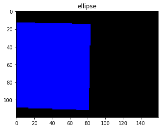<br>
そこで弧の描画はfillPolyで行うようにしています。<br>
ソースコード：[./lib/functions.py](./lib/functions.py)<br>
```python
    pts_ellipse = np.array(pts_center[:,int(pts_center.shape[1]/2):,:]).astype(int)
    pts_ellipse = np.concatenate((pts_ellipse,np.array([[[x,y]]]).astype(int)),axis=1)
    cv2.fillPoly(cv_rgb_ellipse, [pts_ellipse], (255,0,0))
```
[<ページTOP>](#top)　[<目次>](#0)

<hr>

<a name='12'>

## [ディレクトリとファイルについて]
* ディレクトリについて
  * documment/ ドキュメント関連
  * demo_lane/ デモ用ディレクトリ
  * lib/ 関数ライブラリ
  * test_images/ ROI,IPM,白色フィルタの確認用ディレクトリ
* ファイルについて
  * README.md このファイル
  * opencv_lane_detection.py レーン検出コード
  * to_region_of_interest.py ROI座標確認コード
  * to_inverse_perspective_mapping.py IPM座標確認コード
  * to_white.py 白色フィルタ確認コード

[<ページTOP>](#top)　[<目次>](#0)


